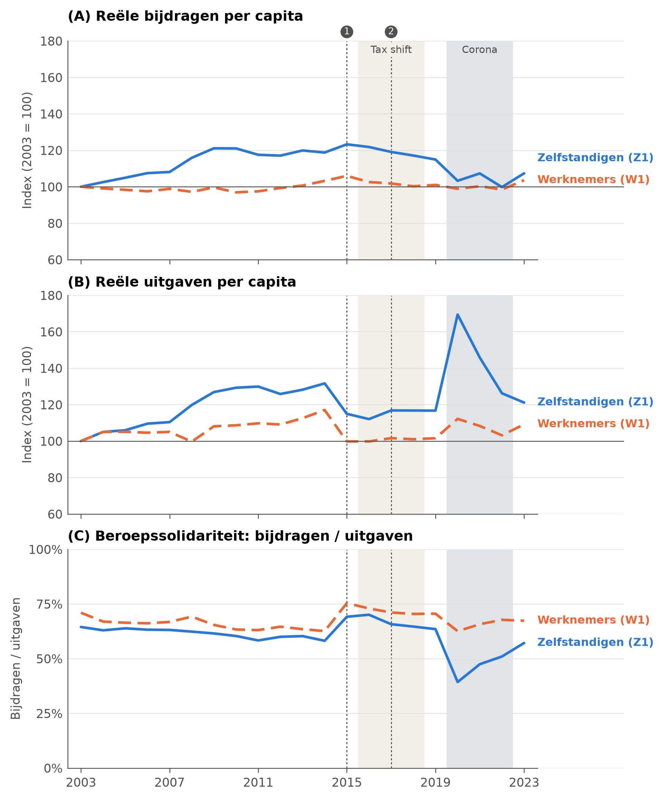
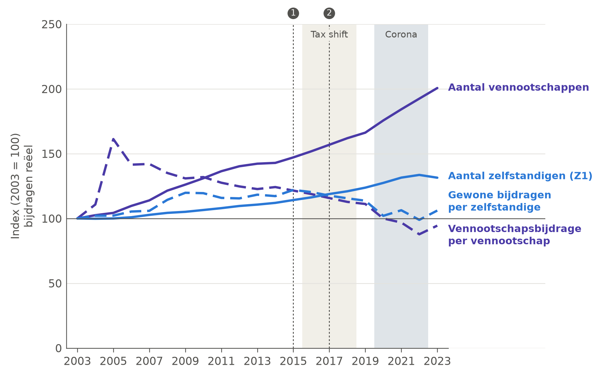
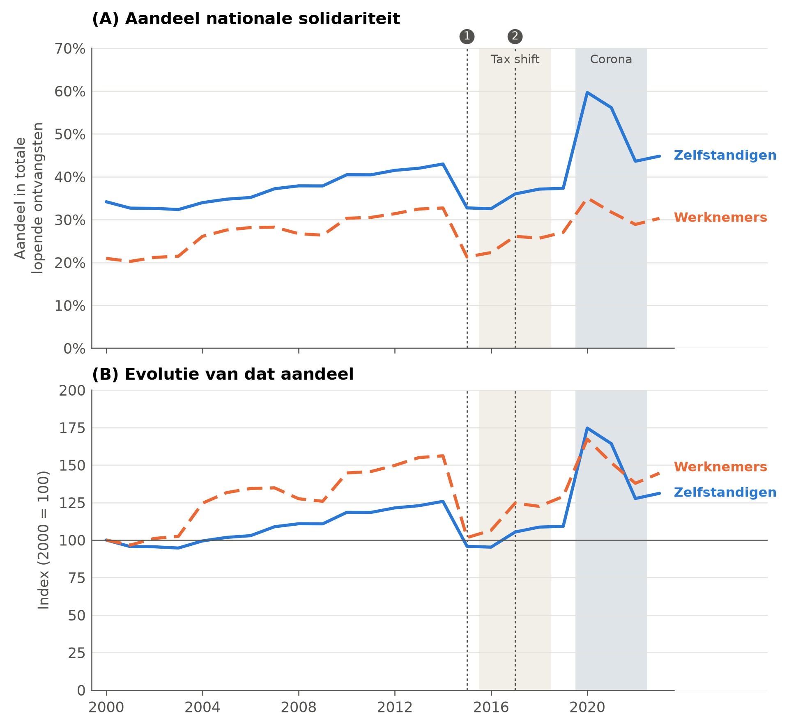
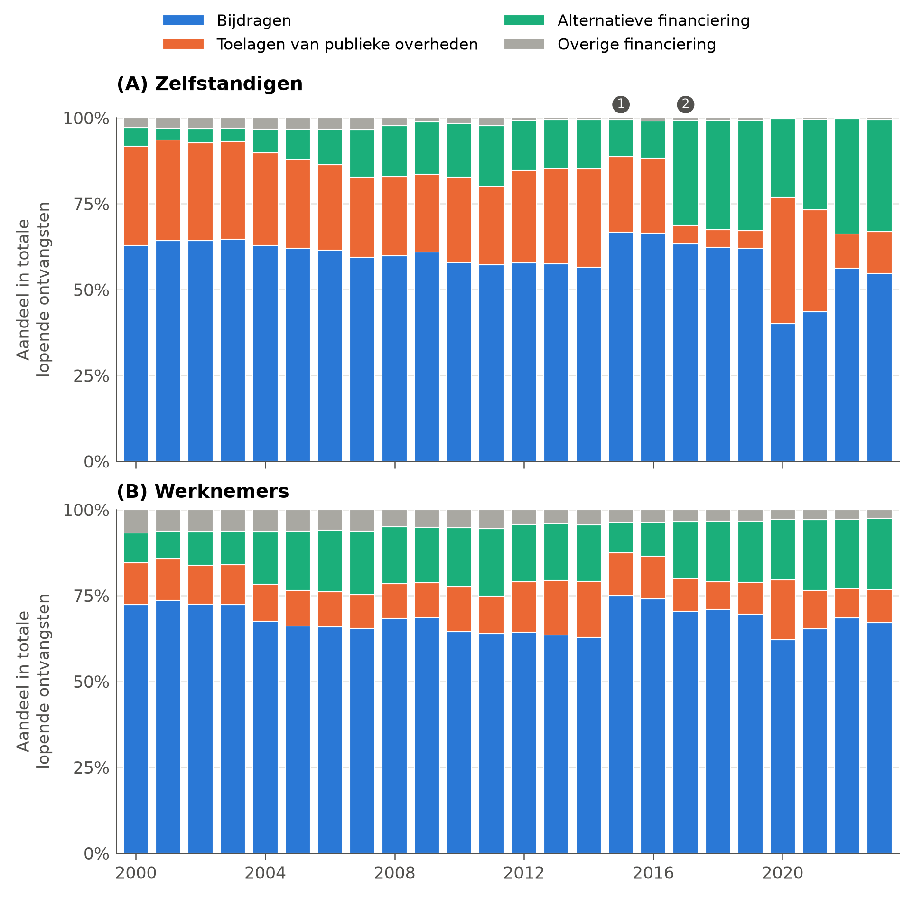

<!-- GEGENEREERD door code/macro/07_tekstcijfers.py uit report/templates/06-1_macro.md. Niet hier bewerken: pas de template aan en draai het script opnieuw. -->

## Macroniveau: beroepssolidariteit en nationale solidariteit

Op het macroniveau, het niveau van de sociale zekerheidsstelsels, analyseren we de beroepssolidariteit en de nationale solidariteit. We bespreken eerst de beroepssolidariteit: in welke mate dekken de sociale bijdragen de uitgaven van het stelsel? Daarna gaan we na welke rol de vennootschapsbijdragen en de verdeling tussen werkgevers- en werknemersbijdragen daarin spelen. Tot slot bekijken we de nationale solidariteit: welk deel van de inkomsten komt uit algemene middelen?

We drukken de verandering van een aandeel of een ratio uit in procentpunten: van 64% naar 57% is een daling van 7 procentpunt. Veranderingen van bedragen per capita drukken we uit als relatieve verandering in procent. We hanteren de populatiedefinities Z1 en W1 als hoofddefinitie (zie Tabel 5); Bijlage 4 toont de resultaten voor Z2 en W2. De figuren markeren twee periodes met een band, de tax shift (2016-2018) en de coronacrisis (2020-2022), en twee wijzigingen die de bijdragen en uitgaven zelf aantasten met een genummerde lijn: de zesde staatshervorming (2015) en de hervorming van de financiering van de sociale zekerheid (2017).

### Beroepssolidariteit

Figuur 4 toont de evolutie van de reële bijdragen per capita (A), de reële uitgaven per capita (B) en de verhouding tussen beide, de beroepssolidariteit (C), telkens voor zelfstandigen en werknemers samen. We onderscheiden drie vaststellingen.

**Ten eerste ligt de beroepssolidariteit systematisch lager bij zelfstandigen en daalt ze er sterker.** In 2003 dekten de sociale bijdragen 71% van de uitgaven in het werknemersstelsel (bijdragen van werknemers en werkgevers samen) en 64% in het zelfstandigenstelsel. In 2023 was dat respectievelijk 67% en 57%. De beroepssolidariteit daalde dus met 3,6 procentpunt bij werknemers en met 7,3 procentpunt bij zelfstandigen. In elk jaar van de periode ligt ze bij zelfstandigen lager dan bij werknemers.

**Ten tweede zien we over de volledige periode dat de uitgaven sneller groeiden dan de bijdragen.** Tussen 2003 en 2023 stegen de reële uitgaven per zelfstandige met 21%, de reële bijdragen per zelfstandige met 7%. Bij werknemers stegen de uitgaven per capita met 9% en de bijdragen met 4%. De uitgaven per capita groeiden bij zelfstandigen dus 2,3 keer zo snel als bij werknemers, terwijl de bijdragen per capita in beide stelsels veel minder meegroeiden. Een groot deel van die uitgavengroei (naast de coronapiek) is het gevolg van bewuste uitbreidingen van de bescherming van zelfstandigen, zoals de integratie van de kleine risico's in de ziekteverzekering, de invoering van het maxistatuut voor meewerkende echtgenoten en de optrekking van het minimumpensioen (zie Bijlage 1), en van rijpende pensioenrechten: de pensioenen vertegenwoordigden 53% van de uitgaven van het zelfstandigenstelsel in 2003 en 56% in 2023.

De verdeling over bijdragen en uitgaven hangt af van de populatiedefinitie, de daling van de beroepssolidariteit zelf niet. Omdat de bijdragen en de uitgaven door hetzelfde aantal verzekerden worden gedeeld, is de ratio onder Z1 en Z2 identiek. Onder de brede definitie Z2 daalden de reële bijdragen per capita met 3% en stegen de uitgaven per capita met 9%. Het verschil met Z1 komt volledig van de sterke groei van het aantal zelfstandigen in bijberoep, die in de noemer van Z2 wel meetellen maar weinig bijdragen en in beperkte mate rechten openen.[^def]

**Ten derde verschilt het beeld sterk naargelang de periode.** Figuur 4 laat vier periodes zien, die we afzonderlijk bespreken.

*2003-2014: de uitgaven stijgen sneller dan de bijdragen.* In beide stelsels namen zowel de uitgaven als de bijdragen per capita toe, maar de uitgaven stegen sneller: bij zelfstandigen met 32% tegenover 19% voor de bijdragen, bij werknemers met 17% tegenover 3%. De beroepssolidariteit daalde daardoor met 8,4 procentpunt bij werknemers en met 6,3 procentpunt bij zelfstandigen. In deze periode daalde ze dus bij werknemers iets sterker. Het Rekenhof wijst in opeenvolgende rapporten op de structurele toename van de uitgaven voor ziekte en pensioenen, en op de tijdelijke toename van de uitgaven na de financieel-economische crisis van 2008.[^rekenhof] Bij zelfstandigen komt daar de integratie van de kleine risico's in de ziekteverzekering bij (2006-2008).

<!-- wijziging: redactie | Afkortingen (22 september 2026): RIZIV voluit bij het eerste gebruik. -->

*2015: een breuk in de reeksen door de zesde staatshervorming.* In 2015 dalen de reële uitgaven per capita abrupt, met 13% bij zelfstandigen en 15% bij werknemers. Dat is geen besparing maar een wijziging in wat de rekeningen bevatten. Met de zesde staatshervorming verdwijnt de gezinsbijslag uit de federale sociale zekerheid: in het werknemersstelsel ging het in 2014 nog om €5,3 miljard, in het zelfstandigenstelsel om €0,26 miljard, en vanaf 2015 om niets meer. Ook de overdrachten naar het Rijksinstituut voor Ziekte- en Invaliditeitsverzekering (RIZIV) voor geneeskundige verzorging dalen tussen 2014 en 2015, met €2,9 miljard bij werknemers en €0,26 miljard bij zelfstandigen.[^breuk] De beroepssolidariteit springt daardoor in één jaar omhoog, met 12,8 procentpunt bij werknemers en 11,0 procentpunt bij zelfstandigen. Die sprong is een boekhoudkundig effect en geen versterking van de beroepssolidariteit. Evoluties over het jaar 2015 heen, zoals de verandering tussen 2003 en 2023, moeten daarom met voorzichtigheid gelezen worden: ze bevatten een eenmalige opwaartse sprong die de onderliggende daling gedeeltelijk maskeert.

*2016-2018: de tax shift verlaagt de bijdragen.* De tax shift verlaagde de bijdragevoet van zelfstandigen gefaseerd van 22% naar 21,5% (2016), 21% (2017) en 20,5% (2018), en de basiswerkgeversbijdrage van 32,4% naar 30% (april 2016) en 25% (2018).[^taxshift] Tussen 2015 en 2018 daalden de reële bijdragen per capita met 5% bij zelfstandigen en 5% bij werknemers, terwijl de uitgaven per capita nagenoeg stabiel bleven (+2% en +1%). De beroepssolidariteit daalde in die drie jaar met 4,5 procentpunt bij zelfstandigen en 4,9 procentpunt bij werknemers. Het inkomstenverlies werd gecompenseerd via de alternatieve financiering (zie verder). In 2019 dekten de bijdragen 63% van de uitgaven bij zelfstandigen en 71% bij werknemers.

*2020-2022: de coronacrisis treft vooral het zelfstandigenstelsel.* In 2020 stegen de reële uitgaven per capita met 45% bij zelfstandigen en met 10% bij werknemers. De bijdragen per capita daalden met respectievelijk 10% en 2%. De beroepssolidariteit zakte bij zelfstandigen naar 39% (-24,2 procentpunt), bij werknemers naar 63% (-8,0 procentpunt). Het verschil in impact hangt samen met de steunmaatregelen. Bij werknemers drukten vooral de tijdelijke werkloosheid en een dalende loonmassa de bijdragen, met een piek in maart, april en mei 2020. Bij zelfstandigen verhoogde het crisis-overbruggingsrecht de uitgaven, terwijl uitstel van betaling, de vrijstelling van voorlopige bijdragen en de kwijtschelding van verhogingen de bijdragen drukten. Die maatregelen liepen door tot 2022 (Rekenhof, 2022: 27-28; Rekenhof, 2023: 60-61). Ook voor vennootschappen gold uitstel van betaling in 2020 en 2021. In 2022 lagen de uitgaven per zelfstandige nog 8% boven het niveau van 2019 en de bijdragen 13% eronder; bij werknemers lagen de uitgaven 2% hoger en de bijdragen 3% lager.

*2023: herstel, maar niet tot het niveau van voor corona.* De beroepssolidariteit herstelde in 2023 tot 57% bij zelfstandigen en 67% bij werknemers, maar bleef in beide stelsels onder het niveau van 2019. Opvallend is dat de reële bijdragen per zelfstandige in 2023 nog 7% onder het niveau van 2019 lagen, terwijl die per werknemer 3% hoger lagen. Omdat de bijdragen van zelfstandigen met vertraging worden geregulariseerd, kan 2023 nog naweeën van de coronamaatregelen bevatten; één jaar volstaat niet om van een blijvend effect te spreken.

Samengelegd tonen de periodes dat de drijvende kracht achter de lagere beroepssolidariteit van zelfstandigen verschuift. Vóór de breuk van 2015 verklaren de sneller stijgende uitgaven de daling in beide stelsels, en daalde de beroepssolidariteit bij werknemers zelfs iets sterker. Na 2015 daalt ze sterker bij zelfstandigen (-12,0 procentpunt tegenover -8,0 procentpunt bij werknemers), en daar spelen de bijdragen wél een grote rol: tussen 2015 en 2023 daalden de reële bijdragen per zelfstandige met 13%, die per werknemer met 2%. Bij een ongewijzigde bijdragebasis doet de verlaging van de bijdragevoet van 22% naar 20,5% de bijdragen mechanisch met 6,8% dalen, ongeveer de helft van die daling. De rest weerspiegelt de naweeën van de coronacrisis en een bijdragebasis die niet meegroeide. Dat laatste stelt ook de Hoge Raad van Financiën vast: de gemiddelde reële bijdragebasis van zelfstandigen in hoofdberoep, inclusief bedrijfsleiders, bleef stabiel tot 2014 en daalde daarna, terwijl het reële brutoloon van werknemers bleef stijgen (Hoge Raad van Financiën, 2024: 50).

**Figuur 4.** Beroepssolidariteit: reële bijdragen en uitgaven per capita en hun verhouding, zelfstandigen en werknemers, populatiedefinities Z1 en W1, België, 2003-2023

Noot: bijdragen en uitgaven gecorrigeerd voor inflatie op basis van de consumptieprijsindex (prijzen van 2024) en gedeeld door het aantal verzekerden volgens de definities Z1 en W1 (Tabel 5). In (A) en (B) zijn de waarden van 2003 gelijkgesteld aan 100. Bijlage 4 toont de resultaten voor Z2 en W2. Grijze banden: tax shift (2016-2018) en coronacrisis (2020-2022). (1) 2015: zesde staatshervorming, de gezinsbijslag verdwijnt uit de federale rekeningen van de sociale zekerheid (breuk in de uitgavenreeks). (2) 2017: hervorming van de financiering van de sociale zekerheid (wet van 18 april 2017).

Bron: eigen berekeningen op basis van FOD Sociale Zekerheid (persoonlijke communicatie, 18 april 2025), KSZ (2026) en Statbel (2026a).

### De rol van de vennootschappen

Omdat het aantal vennootschappen sterk is toegenomen (zie §2), bekijken we afzonderlijk hoe de vennootschapsbijdrage zich tot de beroepssolidariteit verhoudt. De sociale bijdragen in het zelfstandigenstelsel bestaan grotendeels uit gewone bijdragen van zelfstandigen; de vennootschapsbijdragen vertegenwoordigden 3,9% van de bijdragen in 2003, 6,3% in 2005 en 5,2% in 2023. Het overige deel, onder meer bijdragen van publieke mandatarissen en op premies van de tweede pensioenpijler, is verwaarloosbaar. Figuur 5 toont de evolutie van het aantal vennootschappen en zelfstandigen, en van de reële bijdragen per vennootschap en per zelfstandige.

**De vennootschapsbijdrage per vennootschap is uitgehold door het uitblijven van indexering.** Het aantal vennootschappen verdubbelde tussen 2003 en 2023 (+101%), maar de bijdrage per vennootschap volgde niet. Uitgedrukt in nominale euro per vennootschap lag de bijdrage van 2006 tot en met 2019 veertien jaar lang vlak, tussen €403 en €422. In reële termen daalde ze tussen 2006 en 2019 met 21,4%, en dat is precies het waardeverlies van een bevroren bedrag door inflatie over dezelfde periode (-21,4%). De daling van de reële bijdrage per vennootschap is dus volledig toe te schrijven aan de niet-indexering van de forfaitaire bedragen, en niet aan een verschuiving van vennootschappen naar de lagere schijf. Van 2006 tot 2023 verloor de bijdrage per vennootschap een derde van haar reële waarde, van €633 naar €422 in prijzen van 2024. In 2023 werden de bedragen verhoogd en werd een jaarlijkse indexering ingevoerd.[^vb2004]

**Door de groei van het aantal vennootschappen bleef het negatieve effect op de beroepssolidariteit beperkt.** De vennootschapsbijdragen dekten 3,5% van de uitgaven van het zelfstandigenstelsel in 2006 en 3,0% in 2023. Die daling van 0,5 procentpunt is ongeveer 9% van de totale daling van de beroepssolidariteit over dezelfde periode (-6,1 procentpunt). Het effect is beperkt gebleven omdat de groei van het aantal vennootschappen (+83% sinds 2006) het grootste deel van de erosie per vennootschap compenseerde. Was het bedrag van 2006 mee geïndexeerd, dan hadden de vennootschapsbijdragen in 2023 4,5% van de uitgaven gedekt. De niet-indexering kostte het stelsel in 2023 dus 1,5 procentpunt beroepssolidariteit, of ongeveer €0,14 miljard aan bijdragen.

<!-- wijziging: redactie | Resultaat van de sensitiviteitsanalyse vereenvoudigd (vraag Wim, 22 september 2026): het omslagpunt uitgelegd als vergelijking tussen de vennootschapsbijdrage en de gewone bijdrage, met één concreet voorbeeld (typegeval 2 uit Tabel B6.2, regels van 2024 zoals Tabel 1). De zin over het scenario met de helft van de extra vennootschappen en €10.000 winst is geschrapt; dat scenario staat in Tabel B6.1. Cijfers ongewijzigd. -->
Dat is uiteraard een mechanische redenering. Een tegenfeitelijke vraag is hoe de beroepssolidariteit geëvolueerd zou zijn als het aantal vennootschappen niet was toegenomen en dezelfde zelfstandige activiteit in eenmanszaken was uitgeoefend. In Bijlage 6 rekenen we daarvoor een aantal scenario's door. De kern van die oefening is eenvoudig. Een vennootschap betaalt gemiddeld €410 vennootschapsbijdrage per jaar. Als eenmanszaak zou dezelfde zelfstandige daarentegen de gewone bijdrage van 20,5% betalen op de winst die de vennootschap nu niet als bezoldiging uitkeert. Beide bedragen zijn gelijk bij ongeveer €2.000 winst: blijft er per vennootschap minder buiten de bijdragebasis, dan levert de vennootschap het stelsel meer op, blijft er meer buiten, dan de eenmanszaak. Dat omslagpunt is snel bereikt. Neem een zelfstandige met €60.000 winst die zich via een vennootschap de minimumbezoldiging van €45.000 uitkeert, het bedrag dat nodig is voor het verlaagde tarief in de vennootschapsbelasting. Dan blijft €15.000 buiten de bijdragebasis. Als eenmanszaak zou die zelfstandige €12.300 sociale bijdragen betalen, via de vennootschap €9.612, inclusief de vennootschapsbijdrage van €387,34 die een kleine vennootschap in 2024 betaalt. Het stelsel ontvangt dus €2.688 minder. Hoeveel winst werkelijk buiten de bijdragebasis blijft, en hoeveel van de extra vennootschappen de activiteit van een zelfstandige huisvesten, is niet bekend, zodat de analyse geen puntschatting oplevert. Ze laat wel een interpretatie toe: de groei van het aantal vennootschappen versterkt de beroepssolidariteit alleen maar als de extra vennootschappen vrijwel hun volledige winst als loon uitkeren of geen zelfstandige activiteit huisvesten.

**Het belangrijkste mechanisme loopt niet via de vennootschapsbijdrage zelf, maar via gederfde gewone bijdragen.** Wie zijn activiteit in een vennootschap onderbrengt en zich weinig loon uitkeert, vervangt een bijdrage die meegroeit met het inkomen door twee forfaitaire bedragen: de minimumbijdrage als zelfstandige en de vennootschapsbijdrage. De microanalyses in §6.2 tonen hoe groot dat verschil op het niveau van de verzekerde is. Op macroniveau kunnen we dit niet rechtstreeks meten. De gewone bijdragen per zelfstandige (Z1) lagen in 2023 reëel 1% boven het niveau van 2006, maar ze daalden sinds 2015 (-7% tussen 2015 en 2019 en -7% tussen 2019 en 2023). Een daling van de bijdragen per capita zegt echter niet waarom de bijdragebasis achterblijft: daarvoor zouden we de bijdragen moeten afzetten tegen het economische inkomen van de zelfstandige activiteit, en dat inkomen ontbreekt in de gegevens. De Hoge Raad van Financiën (2024: 7) besluit op basis van eigen analyses wel dat een verschuiving van economische activiteit naar de vennootschapsvorm de opbrengst van de sociale bijdragen verlaagt, omdat winsten die niet als arbeidsinkomen worden uitgekeerd uit de heffingsbasis verdwijnen (Hoge Raad van Financiën, 2024: 50).

**Figuur 5.** Beroepssolidariteit binnen het zelfstandigenstelsel: vennootschappen en zelfstandigen, evolutie van het aantal en van de reële bijdragen, populatiedefinitie Z1, België, 2003-2023

Noot: bijdragen gecorrigeerd voor inflatie op basis van de consumptieprijsindex (prijzen van 2024). Vennootschapsbijdragen gedeeld door het aantal actieve vennootschappen, gewone bijdragen gedeeld door het aantal zelfstandigen volgens definitie Z1. De waarden van 2003 zijn gelijkgesteld aan 100. Bijlage 4 toont de resultaten voor Z2. Grijze banden en genummerde lijnen: zie Figuur 4.

Bron: eigen berekeningen op basis van FOD Sociale Zekerheid (persoonlijke communicatie, 18 april 2025), RSVZ (statistiekendatabase, geraadpleegd op 24 oktober 2025), KSZ (2026) en Statbel (2026a).

### Werkgevers- en werknemersbijdragen

Omdat de beroepssolidariteit ook in het werknemersstelsel afneemt, splitsen we de sociale bijdragen van werknemers op in het deel dat door werkgevers en het deel dat door werknemers wordt betaald (Bijlage 5). De FOD SZ-gegevens laten die opsplitsing niet toe; we gebruiken daarom de nationale rekeningen van de Nationale Bank. Die hebben betrekking op een ruimer geheel dan het globaal beheer van de werknemers, onder meer ook de bijdragen voor statutaire ambtenaren: het totaal ligt 10 à 17% hoger dan in de FOD SZ-gegevens van Figuur 4.[^nbb] De opsplitsing geeft dus de verhoudingen weer, niet de exacte bedragen van het werknemersstelsel.

Werkgevers nemen ongeveer twee derde van de bijdragen voor hun rekening (tussen 66% en 68% over de hele periode), werknemers een derde. Tussen 2003 en 2015 stegen de reële werkgeversbijdragen per werknemer met 10% en de werknemersbijdragen met 2%. Tijdens de tax shift daalden de reële werkgeversbijdragen per werknemer met 9% (2015-2018), de werknemersbijdragen met 2%. Over de volledige periode 2003-2023 stegen de reële werknemersbijdragen per capita met 5% en de werkgeversbijdragen met 4%. De verlaging van de patronale bijdragen is dus zichtbaar in de evolutie van de bijdragen in het werknemersstelsel en valt samen met de daling van de beroepssolidariteit tussen 2015 en 2018.

### Nationale solidariteit

<!-- wijziging: cijfer | Eindjaar nationale solidariteit 2024 wordt 2023 (keuze Wim, 21 september 2026): alle reeksen eindigen nu in 2023, en de FOD SZ-cijfers voor 2024 waren ramingen. Geldt voor deze hele subsectie: Figuur 6 en 7, de cijfers in de tekst en de voetnoot over de btw (die cijfers zijn nu plaatshouders; over 2000-2024 gaven ze exact de oude 68%, 32% en 15%, over 2000-2023 worden het 73%, 27% en 15%). De zin 'De bedragen voor 2024 zijn ramingen' in de noten van Figuur 6 en 7 is geschrapt. -->

Tegenover de beroepssolidariteit uit sociale bijdragen staat de nationale solidariteit uit algemene middelen. We meten die als het gezamenlijke aandeel van de toelagen van publieke overheden en de alternatieve financiering in de totale lopende ontvangsten van het stelsel. De toelagen worden gefinancierd uit de algemene belastingontvangsten; de alternatieve financiering bestaat uit toegewezen ontvangsten, zoals een deel van de btw-ontvangsten, de roerende voorheffing en, in het verleden, accijnzen op tabak. Figuur 6 toont het aandeel nationale solidariteit (A) en de evolutie van dat aandeel (B) voor de periode 2000-2023.

<!-- wijziging: cijfer, interpretatie | Eindjaar nationale solidariteit 2024 wordt 2023 (keuze Wim, 21 september 2026): alle reeksen eindigen nu in 2023, en de FOD SZ-cijfers voor 2024 waren ramingen. De toename in procentpunt verschilt nu iets meer (+10,6 tegenover +9,3, voorheen +10,4 tegenover +10,1), dus 'in gelijke mate' en 'vrijwel even groot' worden 'in vergelijkbare mate' en 'van dezelfde orde, iets groter bij zelfstandigen'. -->

**De nationale solidariteit is systematisch groter bij zelfstandigen en nam in beide stelsels in vergelijkbare mate toe.** In 2000 bedroeg het aandeel 34% bij zelfstandigen en 21% bij werknemers; in 2023 was dat opgelopen tot 45% en 30%. In procentpunt is de toename in beide stelsels van dezelfde orde, iets groter bij zelfstandigen: +10,6 procentpunt bij zelfstandigen en +9,3 procentpunt bij werknemers. Uitgedrukt als relatieve groei lijkt de toename groter bij werknemers (+45% tegenover +31%), maar dat is het gevolg van het lagere vertrekpunt.

De evolutie verloopt in fases die aansluiten bij die van de beroepssolidariteit. Tussen 2000 en 2007 steeg het aandeel nationale solidariteit met 3,0 procentpunt bij zelfstandigen en 7,3 procentpunt bij werknemers. Tussen 2007 en 2009 bleef het bij zelfstandigen nagenoeg stabiel (+0,7 procentpunt) en daalde het bij werknemers (-1,9 procentpunt). Tussen 2009 en 2014 steeg het opnieuw (+5,1 procentpunt en +6,3 procentpunt). In 2015 volgt een scherpe daling (-10,2 procentpunt en -11,4 procentpunt). Die daling hangt samen met de breuk in de uitgaven door de zesde staatshervorming: doordat de gezinsbijslag uit de federale rekeningen verdween, waren minder algemene middelen nodig om de stelsels te financieren. Tussen 2015 en 2019 steeg het aandeel opnieuw (+4,6 procentpunt en +5,7 procentpunt), onder meer omdat de lagere bijdragen door de tax shift werden gecompenseerd. De coronacrisis veroorzaakte een uitzonderlijke sprong: in 2020 steeg het aandeel met 22,4 procentpunt bij zelfstandigen, tot 60% van de inkomsten, en met 8,0 procentpunt bij werknemers. In 2022 lag het nog 6,3 procentpunt boven het niveau van 2019 bij zelfstandigen en 1,8 procentpunt bij werknemers.

**Figuur 6.** Nationale solidariteit: aandeel in de inkomsten en evolutie, zelfstandigen en werknemers, België, 2000-2023

Noot: nationale solidariteit is het gezamenlijke aandeel van de toelagen van publieke overheden en de alternatieve financiering in de totale lopende ontvangsten. In (B) is de waarde van 2000 gelijkgesteld aan 100. Grijze banden en genummerde lijnen: zie Figuur 4.

Bron: eigen berekeningen op basis van FOD Sociale Zekerheid (persoonlijke communicatie, 18 april 2025).

**De samenstelling van de nationale solidariteit verschilt tussen de stelsels en veranderde sterk in 2017.** Figuur 7 toont de inkomstenstructuur van beide stelsels, opgesplitst in vier financieringsbronnen. Het aandeel van de sociale bijdragen daalde tussen 2000 en 2023 van 63% naar 55% bij zelfstandigen en van 72% naar 67% bij werknemers. Het aandeel van de toelagen daalde bij zelfstandigen van 29% naar 12% en bij werknemers van 12% naar 10%. De alternatieve financiering nam die rol over: haar aandeel steeg van 5% naar 33% bij zelfstandigen en van 9% naar 21% bij werknemers. De overige financieringsbronnen bleven klein.

<!-- wijziging: nieuw, cijfer | Conclusie (§7, variant A+B, akkoord Wim 22 september 2026): het gewicht van de btw in de nationale solidariteit en in alle inkomsten in 2023, zodat §7 geen cijfer invoert dat niet in §6.1 staat. Laatste zin van deze alinea. -->

Het keerpunt ligt in 2017. De hervorming van de financiering van de sociale zekerheid (wet van 18 april 2017) verving de vroegere staatstoelagen door een basisdotatie, met een verdeelsleutel van 90% voor werknemers en 10% voor zelfstandigen, eventueel aangevuld met een evenwichtsdotatie, en schoeide de alternatieve financiering op een nieuwe leest. In het zelfstandigenstelsel daalden de toelagen tussen 2016 en 2017 van €1,4 miljard naar €0,4 miljard, terwijl de alternatieve financiering steeg van €0,7 miljard naar €2,1 miljard. Het aandeel van de toelagen binnen de nationale solidariteit zakte daardoor bij zelfstandigen van 67% naar 15%, bij werknemers van 56% naar 36%. Sindsdien steunt de nationale solidariteit van zelfstandigen overwegend op de alternatieve financiering, en die bestaat hoofdzakelijk uit btw-ontvangsten.[^btw] Tijdens de coronacrisis werden de toelagen, via de evenwichtsdotatie, tijdelijk opnieuw de belangrijkste bron (62% van de nationale solidariteit bij zelfstandigen in 2020): toegewezen ontvangsten zoals de btw kunnen niet zomaar worden aangewend om een plotse schok op te vangen. In 2023 was het aandeel van de toelagen binnen de nationale solidariteit teruggevallen tot 27% bij zelfstandigen en 32% bij werknemers. Het aandeel van de btw-ontvangsten binnen de nationale solidariteit was toen in beide stelsels vrijwel even groot (54% en 55%), maar omdat de nationale solidariteit bij zelfstandigen groter is, financierde de btw er 24% van alle inkomsten, tegenover 17% bij werknemers.

**Figuur 7.** Nationale solidariteit: inkomstenstructuur van de sociale zekerheid naar financieringsbron, zelfstandigen en werknemers, België, 2000-2023

Noot: aandelen in de totale lopende ontvangsten. Overige financiering omvat toegewezen ontvangsten, externe overdrachten, opbrengsten van beleggingen en diverse ontvangsten. (1) 2015: zesde staatshervorming. (2) 2017: hervorming van de financiering van de sociale zekerheid.

Bron: eigen berekeningen op basis van FOD Sociale Zekerheid (persoonlijke communicatie, 18 april 2025).

### Samenvatting

De beroepssolidariteit daalde tussen 2003 en 2023 in beide stelsels, maar sterker bij zelfstandigen (-7,3 procentpunt tegenover -3,6 procentpunt), en ze ligt er in elk jaar lager. Over de volledige periode is de snellere groei van de uitgaven de belangrijkste verklaring, en een groot deel daarvan weerspiegelt een bewuste uitbreiding van de bescherming van zelfstandigen. Sinds 2015 dalen daarnaast de bijdragen per zelfstandige, door de verlaging van de bijdragevoet in de tax shift, een bijdragebasis die niet meegroeit en de naweeën van de coronacrisis. De vennootschapsbijdrage verloor door het uitblijven van indexering een derde van haar reële waarde per vennootschap, maar door de groei van het aantal vennootschappen bleef haar effect op de beroepssolidariteit beperkt tot ongeveer 9% van de daling sinds 2006. De uitholling van de gewone bijdragen doordat inkomen in vennootschappen wordt ondergebracht, is op macroniveau niet rechtstreeks meetbaar, maar wordt door de Hoge Raad van Financiën (2024) wel vastgesteld.

Tegenover de dalende beroepssolidariteit staat een stijgende nationale solidariteit, die in beide stelsels met ongeveer 10 procentpunt toenam en bij zelfstandigen op een hoger niveau ligt. Sinds de financieringshervorming van 2017 steunt die nationale solidariteit bij zelfstandigen vooral op alternatieve financiering uit btw-ontvangsten. Welke verdelingsgevolgen dat heeft, bespreken we in de conclusie.

[^def]: Zelfstandigen in bijberoep openen voor de meeste risico's pas volwaardige rechten als hun bijdragen minstens het niveau van de minimumbijdrage in hoofdberoep bereiken. Dezelfde persoon kan in meer dan één definitie voorkomen: de posities n142 en n143 zitten zowel in Z1 als in W2, positie n141 zowel in W1 als in Z2 (Tabel 5).

[^rekenhof]: Zie de jaarlijkse 'Boeken' van het Rekenhof over de sociale zekerheid, <https://www.ccrek.be/nl/publications/legislative-level/119/59>. Voor de nasleep van de financieel-economische crisis in 2008, zie onder meer de 'Crisis country case study: Belgium' van de International Social Security Association (ISSA, 2010).

[^breuk]: Bij zelfstandigen verdween de gezinsbijslag al gedeeltelijk in 2014: in 2013 bedroeg hij nog €0,45 miljard (6,9% van de uitgaven). De totale nominale uitgaven daalden tussen 2014 en 2015 met €10,0 miljard bij werknemers en €0,7 miljard bij zelfstandigen. In 2015 ging ook de nieuwe berekening van de sociale bijdragen van zelfstandigen van start, op basis van het inkomen van het lopende jaar met regularisatie achteraf (zie Bijlage 1).

[^taxshift]: Voor het tijdspad van de verlagingen, zie Bijlage 1. Door de verlaging van de bijdragevoet daalde de bijdrage van zelfstandigen in hoofdberoep bij een ongewijzigde bijdragebasis met 6,8%.

[^vb2004]: De gedifferentieerde vennootschapsbijdrage werd ingevoerd vanaf 2004, met een verminderd bedrag voor vennootschappen met een balanstotaal onder een drempel. De gemiddelde bijdrage per vennootschap steeg in die jaren: van €271 in 2003 en €307 in 2004 naar €459 in 2005 en €410 in 2006. Dat wijst erop dat de hervorming de bijdrage gemiddeld verhoogde en niet verlaagde; de sprong van 2005 kan ook een inningseffect bevatten.

[^nbb]: Nationale Bank van België, nationale rekeningen, totale overheid: werkelijke sociale premies ten laste van de werkgevers (D.611) en ten laste van de werknemers (D.613).

[^btw]: In de periode 2000-2023 vertegenwoordigden de btw-ontvangsten tussen 73% en 100% van de alternatieve financiering in het zelfstandigenstelsel, tegenover maximaal 27% voor de roerende voorheffing en maximaal 15% voor de overige alternatieve financieringsbronnen. In het werknemersstelsel is de samenstelling gelijkaardig (btw tussen 64% en 100%, roerende voorheffing maximaal 29%).
