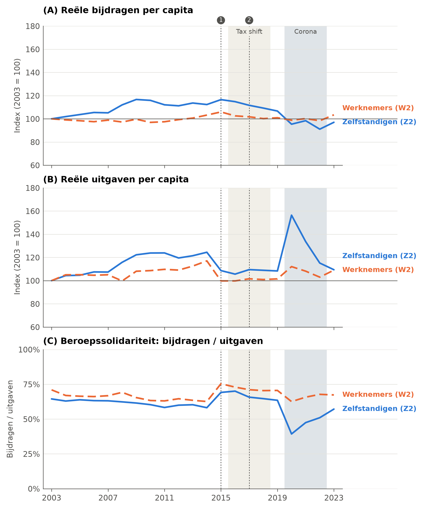
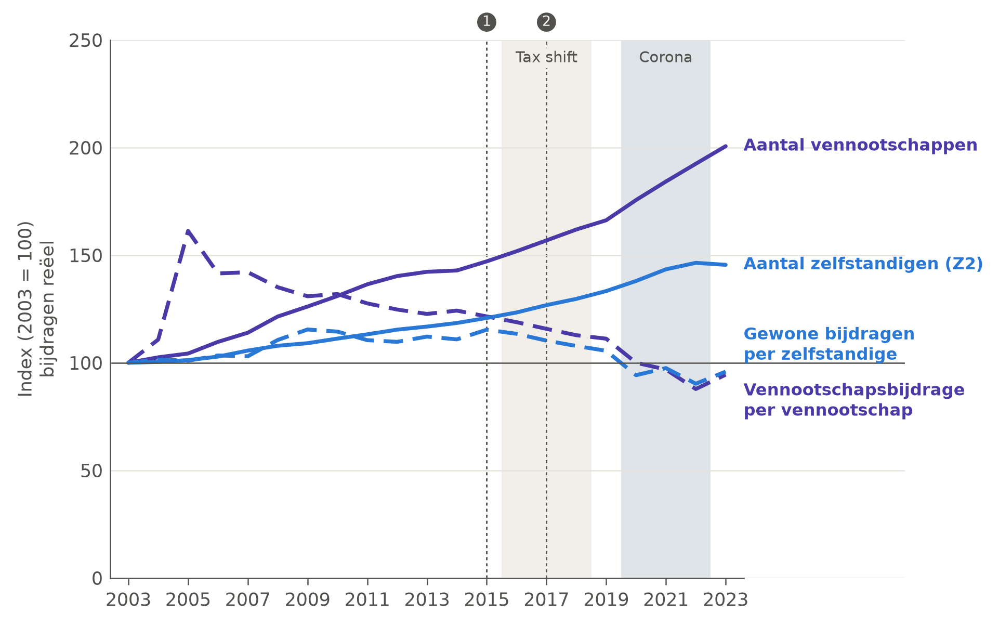
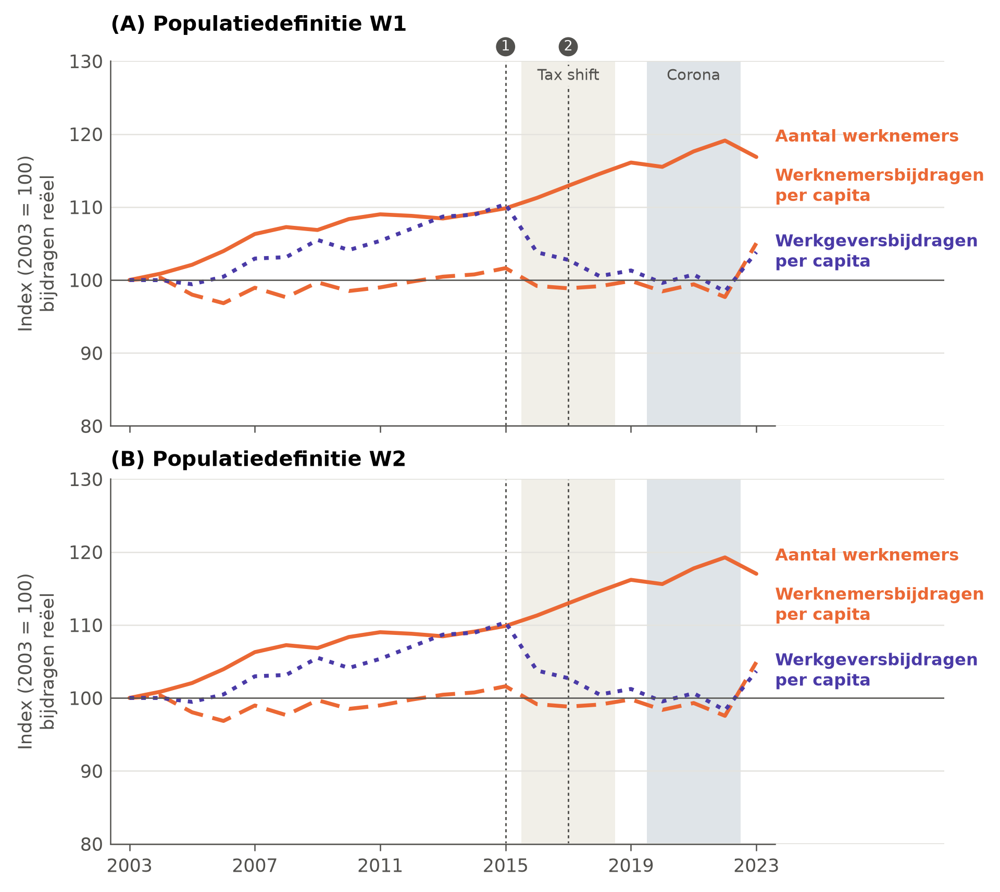

<!-- GEGENEREERD door code/macro/07_tekstcijfers.py uit report/templates/bijlage4-5_macro.md. Niet hier bewerken: pas de template aan en draai het script opnieuw. -->

<!--
TEMPLATE, overgenomen uit Rapport UNIZO_finaal_TC.docx met code/tekst/importeer_micro_bijlagen.py.
Wijzigingen ten opzichte van het origineel staan aangeduid met een commentaar wijziging: vlak boven de alinea.
-->

## Bijlage 4: Resultaten solidariteit op macroniveau, beroepssolidariteit, populatiedefinities Z2 en W2

<!-- wijziging: figuur | Nieuwe figuur (code/macro/05_figures.py), zelfde opbouw als Figuur 4: drie panelen (bijdragen, uitgaven, verhouding) in plaats van een tweede y-as. Bijschrift, noot en bron afgestemd op Figuur 4. -->

**Figuur B4.1.** Beroepssolidariteit: reële bijdragen en uitgaven per capita en hun verhouding, zelfstandigen en werknemers, populatiedefinities Z2 en W2, België, 2003-2023

Noot: bijdragen en uitgaven gecorrigeerd voor inflatie op basis van de consumptieprijsindex (prijzen van 2024) en gedeeld door het aantal verzekerden volgens de definities Z2 en W2 (Tabel 5). In (A) en (B) zijn de waarden van 2003 gelijkgesteld aan 100. Grijze banden en genummerde lijnen: zie Figuur 4.

Bron: eigen berekeningen op basis van FOD Sociale Zekerheid (persoonlijke communicatie, 18 april 2025), KSZ (2026) en Statbel (2026a).

<!-- wijziging: figuur | Nieuwe figuur (05_figures.py), zelfde opbouw als Figuur 5. Noot en bron afgestemd op Figuur 5. -->

**Figuur B4.2.** Beroepssolidariteit binnen het zelfstandigenstelsel: vennootschappen en zelfstandigen, evolutie van het aantal en van de reële bijdragen, populatiedefinitie Z2, België, 2003-2023

Noot: bijdragen gecorrigeerd voor inflatie op basis van de consumptieprijsindex (prijzen van 2024). Vennootschapsbijdragen gedeeld door het aantal actieve vennootschappen, gewone bijdragen gedeeld door het aantal zelfstandigen volgens definitie Z2 (Tabel 5). De waarden van 2003 zijn gelijkgesteld aan 100. Grijze banden en genummerde lijnen: zie Figuur 4.

Bron: eigen berekeningen op basis van FOD Sociale Zekerheid (persoonlijke communicatie, 18 april 2025), RSVZ (statistiekendatabase, geraadpleegd op 24 oktober 2025), KSZ (2026) en Statbel (2026a).

## Bijlage 5: Sociale bijdragen werknemers opgesplitst naar werknemers- en werkgeversbijdrage

<!-- wijziging: figuur | Nieuwe figuur (05_figures.py): één paneel per populatiedefinitie. Noot aangevuld. -->

**Figuur B5.1.** Beroepssolidariteit binnen het werknemersstelsel: evolutie van het aantal werknemers en van de reële werknemers- en werkgeversbijdragen per capita, populatiedefinities W1 en W2, België, 2003-2023

Noot: bijdragen gecorrigeerd voor inflatie op basis van de consumptieprijsindex (prijzen van 2024) en gedeeld door het aantal werknemers volgens de definities W1 (A) en W2 (B) uit Tabel 5. De waarden van 2003 zijn gelijkgesteld aan 100. Grijze banden en genummerde lijnen: zie Figuur 4.

Bron: eigen berekeningen op basis van Nationale Bank van België (2025), KSZ (2026) en Statbel (2026a).
