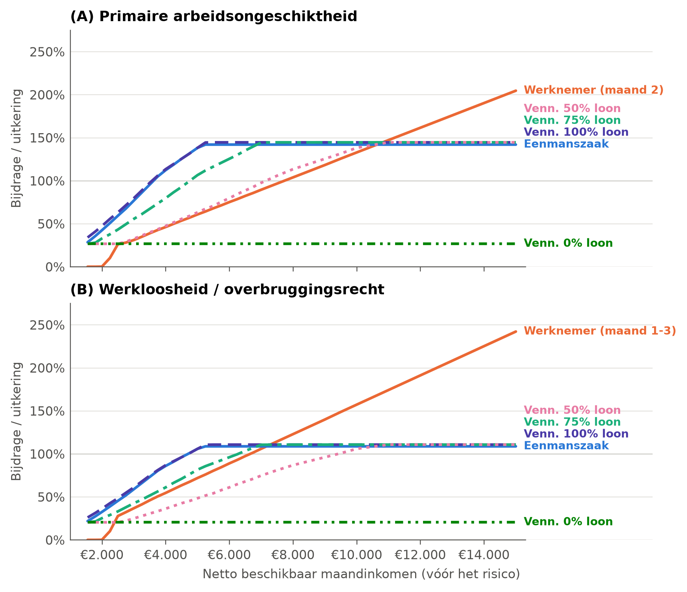
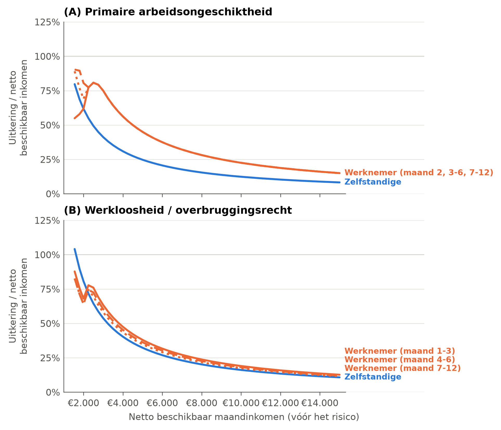
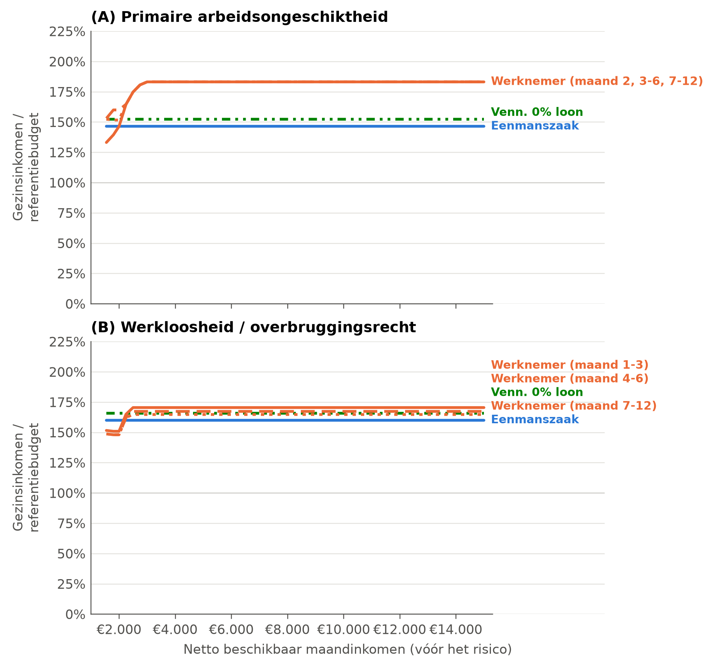

<!-- GEGENEREERD door code/macro/07_tekstcijfers.py uit report/templates/bijlage7_micro_koppels.md. Niet hier bewerken: pas de template aan en draai het script opnieuw. -->

<!--
TEMPLATE, overgenomen uit Rapport UNIZO_finaal_TC.docx met code/tekst/importeer_micro_bijlagen.py.
Wijzigingen ten opzichte van het origineel staan aangeduid met een commentaar wijziging: vlak boven de alinea.
Oorspronkelijk Bijlage 6. De cijfers zijn overgenomen zoals ze in het werkboek staan, met één correctie:
de netto uitkering van de samenwonende zelfstandige bij ziekte stond op €1.309,29, hoger dan de bruto
uitkering van €1.235,20 (leesnota J2). Sinds 22 september 2026 staat die rij op netto = bruto (m05,
CORRECTIES_VAST). Ze raakt Tabel B7.1 (ziekte), Tabel B7.2 (ziekte) en Figuur B7.3.
-->

<!-- wijziging: redactie | Oude Bijlage 6 wordt Bijlage 7 (de nieuwe Bijlage 6 is de sensitiviteitsanalyse bij §6.1); figuur- en tabelnummers mee aangepast. -->

## Bijlage 7: Resultaten solidariteit op microniveau voor koppels met 2 kinderen (2 en 4 jaar)

Bij de pensioenen veronderstellen we dat het inkomen van de partner voldoende hoog is om geen recht te hebben op een gezinspensioen. Bijgevolg is er geen verschil in uitkering tussen alleenstaanden en koppels. Daarom tonen we in onderstaande figuren en tabellen panel C niet.

### Verticale solidariteit aan de bijdragezijde

Het gezinstype heeft geen invloed op de betaalde sociale bijdragen. De resultaten voor alleenstaanden en koppels met kinderen zijn gelijk, zie Figuur 8 en Tabel 8.

### Horizontale solidariteit aan de bijdragezijde

<!-- wijziging: figuur | Nieuwe figuur in de huisstijl (code/micro/m06_figuren.py). -->

**Figuur B7.1.** Horizontale solidariteit: equivalentiegraad tussen bijdragen en uitkering, primaire arbeidsongeschiktheid (A) en werkloosheid/overbruggingsrecht (B), koppels met 2 kinderen (2 en 4 jaar), zelfstandigen en werknemers, naar netto beschikbaar inkomen, 2024

Noot: uitkering als samenwonende. Bij panel A is er voor werknemers geen verschil naargelang de uitkeringsmaand; getoond wordt maand 2. Bij panel B zijn er slechts kleine verschillen; getoond wordt maand 1-3. Vennootschap met 100% loon met voordelen van alle aard loopt gelijk met die zonder en wordt niet getoond.

Bron: eigen berekeningen op basis van microsimulaties met Viren en EUROMOD.

<!-- wijziging: cijfer | 22 september 2026, leesnota J2 gecorrigeerd (beslissing Wim). De netto uitkering van de samenwonende zelfstandige bij ziekte staat nu op netto = bruto (€1.235,20 in plaats van €1.309,29). Gevolg voor deze bijlage: de equivalentiegraden bij arbeidsongeschiktheid in Tabel B7.1 liggen ongeveer 5 tot 7 procentpunt hoger (eenmanszaak van 110,2% naar 116,8%), de vervangingsgraad van de zelfstandige in Tabel B7.2 daalt van 29,3% naar 27,7%, en de garantiegraad bij ziekte in Figuur B7.3 ligt ongeveer 2,7 procentpunt lager. De werkloosheidskolommen en alle cijfers voor alleenstaanden blijven ongewijzigd. -->

<!-- wijziging: cijfer | Tabelnummer B6.1 wordt B7.1; cijfers via plaatshouders (stap m05). Uitkeringsmaand van de werknemer in de noot (leesnota J3). -->

<!-- wijziging: opmaak | 22 september 2026: kolommen met "Werkloosheid/overbrugging" breder, de kop liep over de kolom VC heen. -->

**Tabel B7.1.** Horizontale solidariteit: equivalentiegraad, gemiddelde en variatiecoëfficiënt, primaire arbeidsongeschiktheid en werkloosheid/overbruggingsrecht, koppels met 2 kinderen (2 en 4 jaar), zelfstandigen en werknemers, 2024

| | **Arbeidsongeschiktheid: X̅** | **VC** | **Werkloosheid/overbrugging: X̅** | **VC** |
|----------------------------|--------------:|-----------:|--------------:|-----------:|
| Werknemer | 78% | 0,68 | 92% | 0,69 |
| Zelfstandige, eenmanszaak | 117% | 0,31 | 89% | 0,31 |
| Vennootschap, 100% loon (met VAA) | 119% | 0,30 | 91% | 0,30 |
| Vennootschap, 75% loon | 105% | 0,40 | 80% | 0,40 |
| Vennootschap, 50% loon | 80% | 0,53 | 61% | 0,53 |
| Vennootschap, 0% loon | 27% | 0,00 | 20% | 0,00 |

Noot: X̅ = gemiddelde over de gesimuleerde inkomensposities, VC = variatiecoëfficiënt. Werknemer: arbeidsongeschiktheid in maand 2, werkloosheid in maand 1-3.

Bron: eigen berekeningen op basis van microsimulaties met Viren en EUROMOD.

### Horizontale solidariteit aan de uitkeringszijde

<!-- wijziging: figuur | Nieuwe figuur in de huisstijl (m06); 'vervangingsratio's' wordt 'vervangingsgraad' (leesnota D7). -->

**Figuur B7.2.** Horizontale solidariteit: vervangingsgraad, primaire arbeidsongeschiktheid (A) en werkloosheid/overbruggingsrecht (B), koppels met 2 kinderen (2 en 4 jaar), zelfstandigen en werknemers, naar netto beschikbaar inkomen, 2024

Noot: uitkering als samenwonende, in verhouding tot het netto beschikbaar maandinkomen van de verzekerde vóór het risico.

Bron: eigen berekeningen op basis van microsimulaties met Viren en EUROMOD.

<!-- wijziging: cijfer | Tabelnummer B6.2 wordt B7.2; cijfers via plaatshouders. Uitkeringsmaand van de werknemer in de noot, zoals in het origineel (leesnota J3, te bevestigen). -->

<!-- wijziging: opmaak | 22 september 2026: kolommen met "Werkloosheid/overbrugging" breder, de kop liep over de kolom VC heen. -->

<!-- wijziging: cijfer | 22 september 2026, leesnota J3 beslist door Wim: de uitkeringsmaand van de werknemer is geharmoniseerd. Ziekte maand 2 in plaats van vanaf maand 7, werkloosheid maand 1-3 in plaats van maand 4-6, zoals in Tabel 9, 10 en B7.1. De rij van de zelfstandige verandert niet (forfaitaire uitkering). -->

**Tabel B7.2.** Horizontale solidariteit: vervangingsgraad, gemiddelde en variatiecoëfficiënt, koppels met 2 kinderen (2 en 4 jaar), werknemers en zelfstandigen, 2024

| | **Arbeidsongeschiktheid: X̅** | **VC** | **Werkloosheid/overbrugging: X̅** | **VC** |
|----------------------------|--------------:|-----------:|--------------:|-----------:|
| Werknemer | 43% | 0,45 | 40% | 0,53 |
| Zelfstandige (alle rechtsvormen) | 28% | 0,64 | 36% | 0,64 |

Noot: X̅ = gemiddelde over de gesimuleerde inkomensposities, VC = variatiecoëfficiënt. Werknemer: arbeidsongeschiktheid in maand 2, werkloosheid in maand 1-3, zoals in Tabel B7.1.

Bron: eigen berekeningen op basis van microsimulaties met Viren en EUROMOD.

### Verticale solidariteit aan de uitkeringszijde

<!-- wijziging: cijfer, redactie | Bedragen via plaatshouders. 'Bezoldigingsstrategie' wordt 'bezoldigingsstructuur', zoals elders in het rapport. -->

Figuur B7.3 vergelijkt het referentiebudget voor koppels met de uitkering voor samenwonenden, verhoogd met het netto beschikbaar loon van de partner en het ontvangen Groeipakket: de garantiegraad. We tonen enkel het scenario met een laag loon (€2.431,41 netto per maand); de garantiegraad ligt vanzelfsprekend hoger bij koppels waarvan de partner een gemiddeld loon heeft (€3.092,99). Omdat de loonuitkering een invloed heeft op de hoogte van het Groeipakket, verschilt de garantiegraad naargelang de rechtsvorm en bezoldigingsstructuur. Om de figuur overzichtelijk te houden tonen we enkel eenmanszaken en vennootschappen met 0% loonuitkering, in vergelijking met werknemers. Vennootschappen met hogere loonuitkeringen sluiten aan bij de eenmanszaken.

<!-- wijziging: figuur | Nieuwe figuur in de huisstijl (m06). Referentiebudget via plaatshouder. -->

**Figuur B7.3.** Verticale solidariteit: garantiegraad, gezinsinkomen tijdens het risico in verhouding tot het referentiebudget, primaire arbeidsongeschiktheid (A) en werkloosheid/overbruggingsrecht (B), koppels met 2 kinderen (2 en 4 jaar), partner met laag loon, zelfstandigen en werknemers, naar netto beschikbaar inkomen, 2024

Noot: gezinsinkomen = uitkering als samenwonende + netto loon van de partner + Groeipakket. Het referentiebudget voor een koppel met 2 kinderen (2 en 4 jaar) met private huur bedraagt €2.757,51 per maand in het tweede kwartaal van 2024 (Expertisecentrum Budget en Financieel Welzijn, persoonlijke communicatie, 6 november 2025). De horizontale lijn op 100% markeert de minimale levensstandaard.

Bron: eigen berekeningen op basis van microsimulaties met Viren en EUROMOD.
