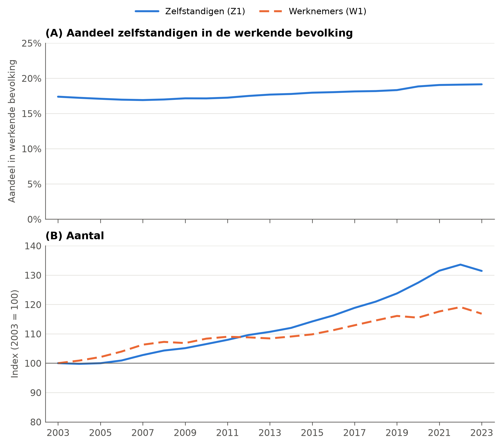
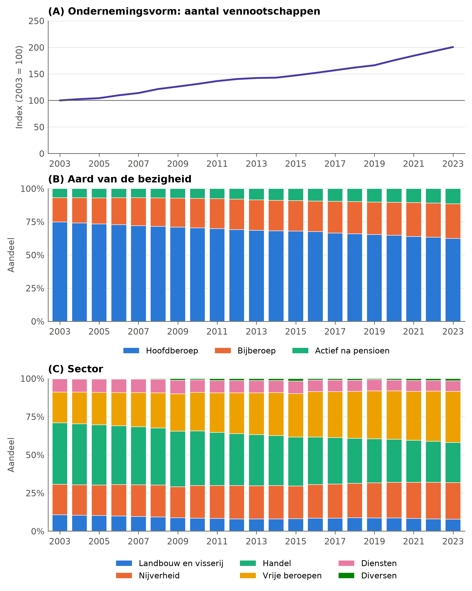
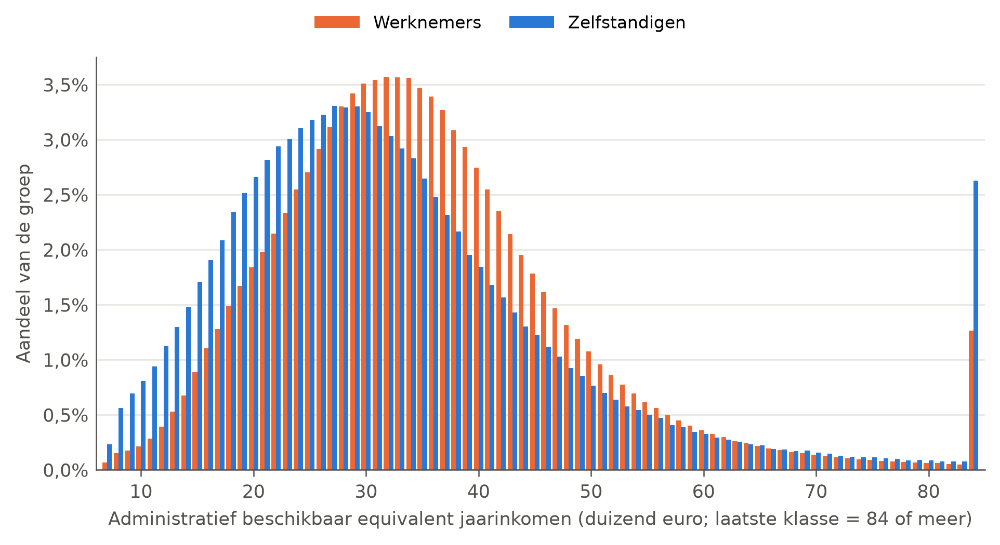

<!--
TEMPLATE, overgenomen uit Rapport UNIZO_finaal_TC.docx met code/tekst/importeer_hoofdstukken.py.
Wijzigingen ten opzichte van het origineel staan aangeduid met een commentaar wijziging: vlak boven de alinea.
-->

# De maatschappelijke context

In deze sectie schetsen we de maatschappelijke context waarin de discussies over de sociale zekerheid voor zelfstandigen wordt gevoerd. De zelfstandigenpopulatie is in de voorbije decennia sterk gegroeid (Figuur 1). Hun aandeel in de werkende bevolking (Figuur 1A) is tussen 2003 en 2023 toegenomen van 17% naar 19%. In absolute aantallen groeide het aantal zelfstandigen met 31% in de voorbije twintig jaar, een stuk sneller dan het aantal werknemers dat groeide met 17% (Figuur 1B).[^1]

<!-- wijziging: interpretatie | Leesnota E: de daling van het aandeel eenmanszaken komt uit een andere bron, periode (2013-2023) en populatie (kmo's) dan de verdubbeling van het aantal vennootschappen (RSVZ, 2003-2023). Nu expliciet als aanvullende bron gepresenteerd in plaats van als keerzijde van dezelfde evolutie. -->

Daarnaast vonden binnen de groep zelfstandigen belangrijke veranderingen plaats wat betreft de ondernemingsvorm, aard van de activiteit en sector (Figuur 2). De opvallendste verandering is de sterke stijging van het aantal vennootschappen: het aantal vennootschappen is verdubbeld tussen 2003 en 2023, een groei van 101% (Figuur 2A) die bovendien veel sterker is dan de groei van de zelfstandigen (Figuur 1B). Een andere bron, over een kortere periode en enkel voor kleine en middelgrote ondernemingen (maximaal 49 werknemers), wijst in dezelfde richting: daar nam het aandeel eenmanszaken af van 50% naar 46% tussen 2013 en 2023 (UNIZO, GraydonCreditsafe & UCM, 2024). Dit is een illustratie van het fenomeen van de *vervennootschappelijking* waar ook de Hoge Raad van Financiën (2024) op heeft gewezen.

<!-- wijziging: redactie | Tikfout 'hoofberoep'. -->

Tussen 2003 en 2023 nam het aandeel zelfstandigen in hoofdberoep af van 75% naar 62% (Figuur 2B) ten voordele van het aandeel zelfstandigen in bijberoep (van 18% naar 26%) en gepensioneerden met een zelfstandige bijverdienste (van 7% naar 12%). In absolute termen steeg het aantal zelfstandigen in de drie groepen, maar is de groei bij zelfstandigen in hoofdberoep (+25%) beduidend minder sterk dan bij zelfstandigen in bijberoep (+110%) en actief na pensioen (+153%). De zelfstandigen in hoofdberoep blijven echter veruit de belangrijkste rol spelen in de financiering van het sociaal statuut: 93% van de inkomsten uit sociale bijdragen is afkomstig van zelfstandigen in hoofdberoep in 2023, tegenover 4% van zelfstandigen in bijberoep en 3% van de gepensioneerden (FOD SZ, persoonlijke communicatie, 25 september 2025). Ook het aandeel zelfstandigen in de vrije beroepen nam fors toe, van 20% in 2003 naar 33% in 2023 (Figuur 2C), terwijl dat in de handel daalde (van 40% naar 26%). In de andere sectoren zijn de evoluties veel minder uitgesproken.[^2]

**Figuur 1.** Evolutie van de zelfstandigen en loontrekkenden in de werkende populatie, België, 2003-2023

Noot: populaties worden bepaald aan de hand van definities Z1 en W1 (zie Tabel 5). Werkende bevolking = Z1 + W1. In (B) zijn de aantallen voor 2003 gelijkgesteld aan 100.

<!-- wijziging: redactie | Afkortingen (22 september 2026): KSZ bij het eerste gebruik voluit (voorheen pas in §5). -->

Bron: eigen bewerking op basis van de [webtoepassing ‘globale cijfers’](https://sami.ksz-bcss.fgov.be/samigc/homePage.xhtml) van de Kruispuntbank van de Sociale Zekerheid (KSZ) (geraadpleegd op 22 december 2025).

**Figuur 2.** Evolutie samenstelling zelfstandigenpopulatie, naar ondernemingsvorm, aard van de activiteit en sector, België, 2003-2023

<!-- wijziging: figuur | Figuur opnieuw gemaakt (code/macro/05_figures.py), in de nieuwe huisstijl en overal voor 2003-2023 (in het origineel liepen paneel B en C tot 2024). Nieuwe noot die zegt wat elk paneel toont. -->

Noot: in (A) is het aantal vennootschappen van 2003 gelijkgesteld aan 100. In (B) en (C): aandelen in het totaal aantal zelfstandigen en helpers.

Bron: eigen bewerking op basis van de [statistiekendatabase](https://websta.rsvz-inasti.fgov.be/nl) van het RSVZ (geraadpleegd op 24 oktober 2025).

Deze veranderingen zijn belangrijk in het licht van de sociale zekerheid voor zelfstandigen. Een groeiend aantal zelfstandigen betekent enerzijds meer potentiële bijdragen, maar anderzijds ook een grotere groep gerechtigden op sociale prestaties. Bovendien brengt de toenemende diversiteit binnen de zelfstandigenpopulatie nieuwe uitdagingen met zich mee op het vlak van solidariteit, gelijkheid en financiering (Heyrman, Colla & Lambrichts, 2017). Zeker de sterke toename van het relatieve belang van vennootschappen om economische activiteit in onder te brengen heeft belangrijke consequenties voor de verschillende vormen van solidariteit, zowel op macro als op microniveau. We gaan er in sectie §6 verder op in.

**Figuur 3.** Inkomensverdeling werknemers en zelfstandigen, 2023

Noot: jaarinkomens van minstens €84.000 worden samengenomen. Werknemers en zelfstandigen worden onderscheiden op basis van de bron van hun beroepsinkomsten. Personen met gecombineerde inkomens worden toegewezen aan de categorie die het grootste aandeel van het beroepsinkomen vertegenwoordigt. Het administratief netto beschikbaar jaarinkomen tracht het inkomensconcept waarop de officiële armoedecijfers gebaseerd zijn, zo goed mogelijk te benaderen met administratieve gegevens. Voor meer informatie, zie <https://statbel.fgov.be/nl/themas/datalab/administratief-beschikbaar-inkomen#documents>.

Bron: Statbel (persoonlijke communicatie, 25 november 2025).

<!-- wijziging: geen | 22 september 2026, leesnota E (redactie): de eerder toegevoegde bijzin over het inkomensbegrip is weer geschrapt op aanwijzing van Wim. De bron (FOD SZ, 2026) rapporteert dit armoederisico op basis van EU-SILC, dus het is wel degelijk het vertrouwde inkomensbegrip en een precisering is overbodig. De zin staat nu weer zoals in het origineel. -->

Ten slotte verschilt de inkomensverdeling van de zelfstandigen op twee cruciale punten van die van de werknemers (Figuur 3). Ten eerste ligt de inkomensverdeling van zelfstandigen duidelijk lager gecentreerd. Het mediane administratief beschikbaar equivalent jaarinkomen bedraagt ongeveer €29.000 voor zelfstandigen, tegenover €33.000 voor werknemers. Zelfstandigen zijn dus sterker vertegenwoordigd in lagere inkomensklassen, wat zich ook vertaalt in een hoger inkomensarmoederisico: 14,2% bij zelfstandigen tegenover 2,8% bij werknemers (FOD SZ, 2026).

Ten tweede vertoont de inkomensverdeling van zelfstandigen een grotere spreiding en ongelijkheid, met relatief grotere aandelen aan zowel de onderkant als de bovenkant van de verdeling. Ongeveer 10% van de werknemers heeft een administratief netto beschikbaar jaarinkomen van hoogstens €20.000, terwijl dit aandeel bij zelfstandigen ongeveer dubbel zo groot is. Tegelijkertijd komen zeer hoge inkomens relatief vaker voor bij zelfstandigen: ongeveer 2,5% van de werknemers heeft een jaarinkomen van minstens €70.000, tegenover meer dan 4% bij zelfstandigen.

Deze structurele verschillen in de inkomensverdeling vormen een belangrijke context voor de analyse van solidariteit op microniveau, aangezien zij mee bepalen hoe bijdragen en uitkeringen zich verhouden tot de draagkracht van beide groepen. We komen er in sectie §6 verder op terug.

[^1]: De werkende bevolking wordt afgebakend volgens de nomenclatuur van de socio-economische positie (KSZ, 2026). Werknemers en zelfstandigen worden vervolgens onderscheiden op basis van hun dominante arbeidsmarktactiviteit. De beschikbare gegevens laten niet toe om zelfstandigen in hoofdberoep, bijberoep en actief na pensioen afzonderlijk te identificeren. Personen die loondienst combineren met een zelfstandige activiteit worden ingedeeld volgens hun hoofdactiviteit; gepensioneerden met een beroepsactiviteit worden geclassificeerd als werknemer of zelfstandige naargelang de aard van die activiteit. Voor meer informatie, zie Tabel 5; voor een vergelijking met de RSVZ cijfers, zie Bijlage 2.

[^2]: De beroepencodes die deel uitmaken van de verschillende sectoren kunnen worden geraadpleegd via <https://www.rsvz.be/nl/naamlijst-en-codes-van-de-beroepen>.
