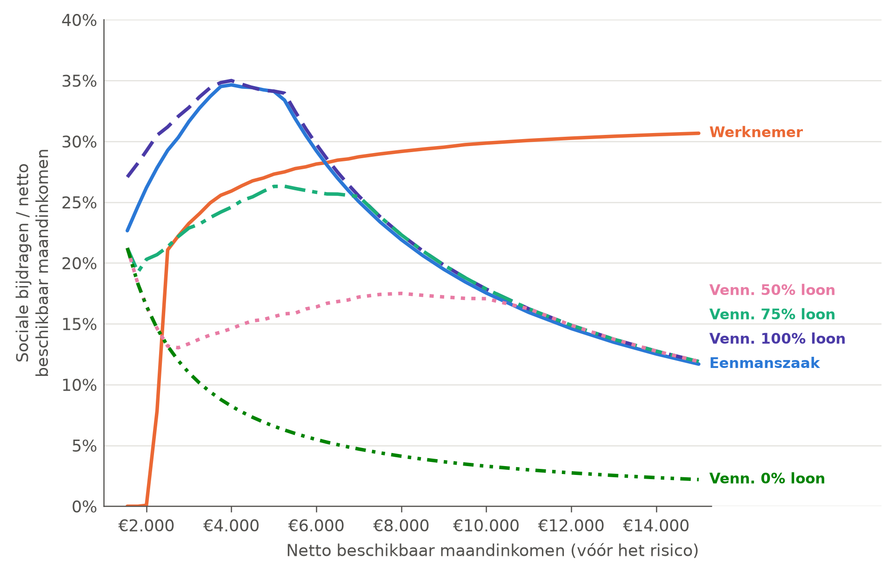
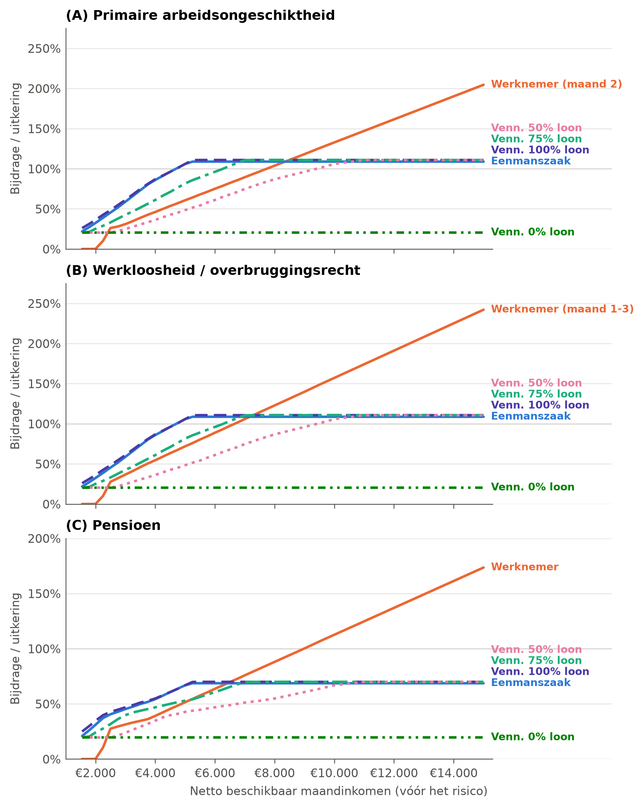
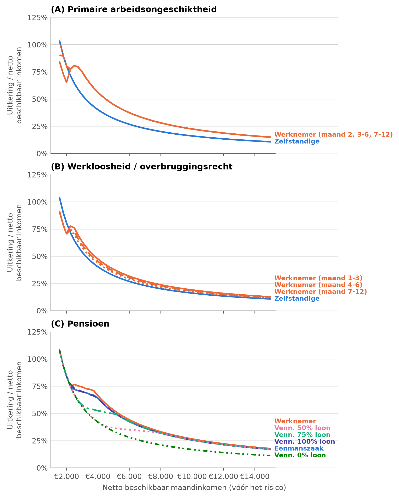
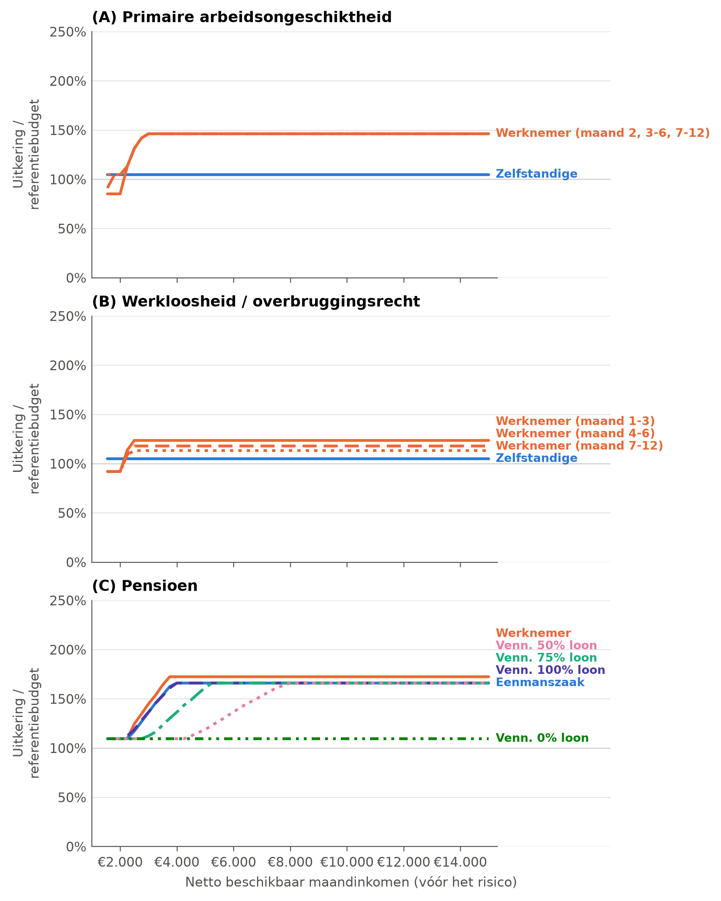

<!--
TEMPLATE, overgenomen uit Rapport UNIZO_finaal_TC.docx met code/tekst/importeer_micro_bijlagen.py.
Wijzigingen ten opzichte van het origineel staan aangeduid met een commentaar wijziging: vlak boven de alinea.
Cijfers: plaatshouders die met mi_ beginnen, uit code/macro/07_tekstcijfers.py (functie micro_cijfers), op basis van
code/micro/m01-m05. De pensioenen zijn herberekend met het blad 'Herberekening pensioenen' (18 september 2026):
de loongrens wordt nu op het loon toegepast vóór de 60%, niet op het pensioen (leesnota J1). De bijstandsbodem in
de netto uitkeringen (J2) en de keuze van de uitkeringsmaand per tabel (J3) zijn nog te bevestigen.
-->

## Microniveau: horizontale solidariteit en verticale solidariteit

Op microniveau analyseren we verschillende dimensies van horizontale en verticale solidariteit die in de verzekeringssystemen zitten ingebouwd. Zoals geschetst in sectie §5.2.2 is dit geen eenvoudige oefening, en bestaat er geen algemeen aanvaarde maatstaf om horizontale en verticale solidariteit in sociale verzekeringssystemen te operationaliseren. In dit onderzoek ontwikkelen we een nieuwe, eigen manier om dit te doen.

<!-- wijziging: redactie | Oude Bijlage 6 (koppels) wordt Bijlage 7, want de nieuwe Bijlage 6 is de sensitiviteitsanalyse bij §6.1. 'Netto beschikbaar inkomens' wordt 'netto beschikbare inkomens'. -->

We vergelijken werknemers, zelfstandigen met een eenmanszaak en zelfstandigen met een vennootschap onder verschillende bezoldigingsstructuren met elkaar. We doen dat op basis van gesimuleerde netto beschikbare inkomens als maatstaf voor de draagkracht (in plaats van een onvergelijkbaar bruto inkomensconcept), zodat we werknemers en zelfstandigen op een coherente manier met elkaar kunnen vergelijken. Het gaat dus om werknemers en zelfstandigen die eenzelfde levensstandaard en dus financiële draagkracht hebben. Deze levensstandaard kan echter voor werknemers en zelfstandigen op basis van verschillende inkomstenbronnen en (para)fiscale keuzes tot stand komen. De simulaties zijn beschikbaar voor twee gezinstypes: alleenstaanden en koppels met kinderen. Deze laatste zijn te vinden in Bijlage 7.

Onze analyse bestaat uit twee stappen. In een eerste stap focussen we op de bijdragen. Eerst evalueren we in welke mate de betaalde sociale bijdragen in verhouding staan tot de financiële draagkracht van de verzekerden. Dit doen we door de verhouding tussen de sociale bijdragen en het netto beschikbaar inkomen in kaart te brengen. Dat is een eerste dimensie van de verticale solidariteit: dragen de sterkste schouders de zwaarste lasten? Vervolgens kijken we naar de verhouding tussen de sociale bijdrage en de uitkeringen die er tegenover staat in geval een sociaal risico zich voordoet. Daarmee evalueren we de equivalentie tussen bijdragen en uitkering. Dat is een eerste dimensie van de horizontale solidariteit.

<!-- wijziging: redactie | Leesnota D7: 'vervangingsratio's' wordt 'vervangingsgraad', de naam uit §5.2.2 en Tabel 4. -->

In een tweede stap evalueren we hoe de sociale verzekeringen zich verhouden tot de twee klassieke doelstellingen van sociale zekerheid: het behoud van de levensstandaard wanneer een sociaal risico zich voordoet en de garantie van een adequaat minimuminkomen. Dat zijn de tweede dimensies van respectievelijk de horizontale en de verticale solidariteit. Hiervoor analyseren we de vervangingsgraad en de mate waarin de uitkering een minimale levensstandaard verzekert (de garantiegraad).

<!-- wijziging: interpretatie | Leesnota B4 en K1: de gemiddelden en de Kakwani-index aan de bijdragezijde worden nu ook gewogen naar de werkelijke inkomensverdeling (§5.2.2.2). De andere tabellen blijven gemiddelden over de gesimuleerde inkomensposities, en dat staat er nu expliciet. -->

De analyse aan de uitkeringszijde gebeurt voor drie sociale risico’s (ziekte, werkloosheid en ouderdom). In tabelvorm objectiveren we de interpretatie van de verschillende aspecten van horizontale en verticale solidariteit via het gemiddelde, de variatiecoëfficiënt of de Kakwani-index. Aan de bijdragezijde tonen we die maatstaven zowel over de gesimuleerde inkomensposities als gewogen naar de werkelijke inkomensverdeling van werknemers en zelfstandigen. De overige gemiddelden zijn gemiddelden over de gesimuleerde inkomensposities, waarbij elke positie even zwaar doorweegt.

### Verticale solidariteit aan de bijdragezijde

<!-- wijziging: interpretatie | Leesnota K1: Tabel 8 toont nu drie versies (posities, BE-SILC 2024, Statbel ADI 2023). -->

Figuur 8 toont de verhouding tussen de betaalde sociale bijdragen en het netto beschikbaar maandinkomen, onze vergelijkbare maatstaf van draagkracht. Hieruit blijkt dat de bijdragestructuur fundamenteel verschilt tussen werknemers en zelfstandigen, en dat bij zelfstandigen zowel de rechtsvorm als de bezoldigingsstructuur een cruciale rol speelt. Tabel 8 vat de resultaten samen en toont de gemiddelde verhouding tussen bijdrage en draagkracht en de Kakwani-index van progressiviteit, telkens over de gesimuleerde inkomensposities en gewogen naar de inkomensverdeling volgens twee bronnen.

<!-- wijziging: cijfer, interpretatie | Leesnota K1: de gemiddelde bijdrage en de Kakwani-index worden gewogen gerapporteerd; de ongewogen waarden blijven ter vergelijking. Hoofdversie gewogen (beslissing 17 september 2026). -->

Bij werknemers is de bijdragestructuur duidelijk progressief: hoe hoger de draagkracht, hoe groter het aandeel van de sociale bijdragen ten opzichte van het beschikbare inkomen. Werknemers met de laagste beschikbare inkomens betalen feitelijk geen sociale bijdragen. Vanaf een netto beschikbaar maandinkomen van €2.250 lopen de sociale bijdragen op van {{mi_br_x_x_wn_x_p2250}} tot {{mi_br_x_x_wn_x_p9000}} bij €9.000 en {{mi_br_x_x_wn_x_p15000}} bij €15.000. Dit toont aan dat binnen het werknemersstelsel de sterkste schouders de zwaarste lasten dragen. Dat zien we ook in Tabel 8. Gewogen naar de inkomensverdeling van werknemers bedragen hun sociale bijdragen gemiddeld {{mi_ratio_silc_wn}} van het netto beschikbaar maandinkomen (BE-SILC) of {{mi_ratio_adi_wn}} (administratieve gegevens), en de Kakwani-index bedraagt {{mi_kak_silc_wn}} of {{mi_kak_adi_wn}}: een duidelijk progressieve bijdragestructuur.

<!-- wijziging: interpretatie, cijfer | Leesnota K2 en K3 (script m03): de verhouding stijgt onder de tussengrens, blijft vlak in de degressieve schijf en daalt boven het plafond; de 23% bij €1.550 is het gewone tarief, want de minimumbijdrage bindt nergens op het rooster. Leesnota K1: gewogen is de eenmanszaak ongeveer proportioneel in plaats van regressief. -->

Bij zelfstandigen is het beeld complexer. Bij een zelfstandige met een eenmanszaak neemt het aandeel sociale bijdragen in verhouding tot de draagkracht aanvankelijk toe: van {{mi_br_x_x_ze_x_p1550}} bij een netto beschikbaar maandinkomen van €1.550 tot {{mi_br_x_x_ze_x_p3750}} bij {{mi_zone_onder_tot}}. Onder de tussengrens is de bijdrage een vast percentage van het netto belastbaar beroepsinkomen. Omdat de personenbelasting progressief is, groeit het beschikbaar inkomen trager dan dat belastbaar inkomen, en stijgt de verhouding tussen bijdrage en draagkracht. Ook op de laagste positie gaat het om het gewone tarief en niet om de minimumbijdrage: het netto belastbaar inkomen ligt daar ({{mi_nbi_laagste_jaar}} per jaar) boven de drempel van de minimumbijdrage. Tussen {{mi_zone_schijf_van}} en {{mi_zone_schijf_tot}}, waar het lagere tarief van 14,16% geldt, blijft de verhouding nagenoeg vlak ({{mi_br_x_x_ze_x_p4000}} tot {{mi_br_x_x_ze_x_p5000}}). Boven de maximumgrens betalen zelfstandigen geen bijkomende bijdragen meer, en daalt het aandeel: bij een netto beschikbaar maandinkomen van €9.000 bedraagt het nog {{mi_br_x_x_ze_x_p9000}} en bij €15.000 {{mi_br_x_x_ze_x_p15000}}. Over de gesimuleerde inkomensposities ligt de gemiddelde verhouding met {{mi_ratio_gelijk_ze}} nipt hoger dan bij werknemers ({{mi_ratio_gelijk_wn}}) en is de Kakwani-index negatief ({{mi_kak_gelijk_ze}}). Gewogen naar de werkelijke inkomensverdeling ligt het beeld anders: zelfstandigen met een eenmanszaak betalen dan gemiddeld {{mi_ratio_silc_ze}} van hun netto beschikbaar inkomen, duidelijk meer dan werknemers, en de Kakwani-index is licht positief ({{mi_kak_silc_ze}} met BE-SILC, {{mi_kak_adi_ze}} met administratieve gegevens). De bijdragen zijn dan ongeveer proportioneel aan de draagkracht. Het verschil komt doordat maar weinig zelfstandigen een inkomen boven de maximumgrens hebben, terwijl de gesimuleerde posities de bovenkant van het inkomensbereik even zwaar laten wegen als de onderkant.

<!-- wijziging: cijfer, interpretatie | Snijpunt met werknemers ligt tussen €6.000 (eenmanszaak) en €6.250 (100% loon). Leesnota K8 en E: 'EU-SILC ... 71% ... lager is de €6.250' steunde op het huishoudinkomen en bevatte een taalfout; met het gestandaardiseerde inkomen, het begrip van de levensstandaard in de typegevallen, ligt 96 tot 98% van de zelfstandigen lager. -->

<!-- wijziging: redactie | Afkortingen (22 september 2026): VAA en VC ingevoerd vóór hun gebruik in de tabellen. -->

Bij zelfstandigen die via een vennootschap werken, wordt de verhouding tussen bijdragen en draagkracht sterk bepaald door de bezoldigingsstructuur, met name de verhouding tussen loon en dividenden. Bij 100% loonuitkering (met of zonder voordelen van alle aard, VAA, meegerekend) sluit de bijdragecurve nauw aan bij die van een eenmanszaak. Bedrijfsleiders betalen zelfs iets meer omwille van de bijkomende vennootschapsbijdrage. Tot {{mi_br_ze_boven_wn_tot}} (eenmanszaak) en {{mi_br_zv100_boven_wn_tot}} (vennootschap met 100% loon) ligt het bijdrageaandeel hoger dan dat van werknemers. Vrijwel alle zelfstandigen hebben een lagere levensstandaard dan dat niveau: {{mi_silc_zs_onder_6250}} volgens BE-SILC en {{mi_adi_zs_onder_6250}} volgens de administratieve gegevens.

<!-- wijziging: cijfer, interpretatie | Leesnota J (tabel tekstcorrecties): 'al vanaf €2.500 minder dan werknemers' klopt voor 50% en 0% loon, bij 75% loon pas vanaf €3.000. Leesnota E en J10: 'iets progressiever' wordt 'minder regressief', met de verklaring voor de niet-monotone volgorde van de indices. Gewogen waarden toegevoegd (K1). -->

Zodra er (gedeeltelijk) met dividenden wordt gewerkt, daalt het bijdrageaandeel en betalen zelfstandigen minder sociale bijdragen dan werknemers: vanaf {{mi_br_zv50_onder_wn_vanaf}} bij 50% en 0% loon, vanaf {{mi_br_zv75_onder_wn_vanaf}} bij 75% loon. Bij 75% loon en 25% dividenden stijgt het bijdrageaandeel licht van {{mi_br_x_x_zv75_x_p1550}} bij €1.550 tot {{mi_br_x_x_zv75_x_p4750}} bij €4.750, blijft vervolgens stabiel tot ongeveer €7.000, en daalt daarna stelselmatig tot {{mi_br_x_x_zv75_x_p15000}} bij €15.000. Bij 50% loon en 50% dividenden daalt de bijdragecurve eerst van {{mi_br_x_x_zv50_x_p1550}} bij €1.550 naar {{mi_br_x_x_zv50_x_p2500}} bij €2.500, vertoont daarna beperkte progressiviteit tot {{mi_br_x_x_zv50_x_p10000}} bij €10.000, om bij hogere inkomens opnieuw te dalen tot {{mi_br_x_x_zv50_x_p15000}} bij €15.000. Over de gesimuleerde posities ligt de verhouding tussen bijdrage en draagkracht gemiddeld een stuk lager dan bij eenmanszaken ({{mi_ratio_gelijk_zv75}} bij 75% loon en {{mi_ratio_gelijk_zv50}} bij 50% loon), en is de bijdragestructuur minder regressief (Kakwani-index van respectievelijk {{mi_kak_gelijk_zv75}} en {{mi_kak_gelijk_zv50}}). Die volgorde is geen toeval: bij 50% loon wordt de maximumbijdrage pas bij de hoogste inkomens bereikt, zodat de verhouding over bijna het hele bereik tussen 13% en 17% blijft, terwijl de eenmanszaak al vanaf {{mi_zone_plafond_van}} tegen het plafond aanloopt. Gewogen is de vennootschap met 75% loon ongeveer proportioneel ({{mi_kak_silc_zv75}}) en die met 50% loon licht regressief ({{mi_kak_silc_zv50}}). Vennootschappen met 0% loon en 100% dividenden kennen het meest regressieve patroon. Het bijdrageaandeel zakt van {{mi_br_x_x_zv00_x_p1550}} bij €1.550 naar {{mi_br_x_x_zv00_x_p6000}} bij €6.000 en verder naar slechts {{mi_br_x_x_zv00_x_p15000}} bij €15.000. Zij dragen nauwelijks bij naar draagkracht en de bijdragestructuur is sterk regressief, ook gewogen (Kakwani-index {{mi_kak_silc_zv00}} met BE-SILC, {{mi_kak_adi_zv00}} met administratieve gegevens).

<!-- wijziging: figuur | Nieuwe figuur in de huisstijl van het macrodeel (code/micro/m06_figuren.py): x-as op schaal, eindlabels. Noot aangevuld met de beheerskosten en het bedrag van de vennootschapsbijdrage (leesnota J7). -->

**Figuur 8.** Verticale solidariteit: sociale bijdragen in verhouding tot het netto beschikbaar maandinkomen, zelfstandigen en werknemers, 2024

Noot: sociale bijdragen van zelfstandigen zijn de eigen sociale bijdragen (inclusief 3,05% beheerskosten van het sociaal verzekeringsfonds) plus, bij een vennootschap, de vennootschapsbijdrage (laagste bedrag, €387,34 per jaar). Bij werknemers worden enkel de werknemersbijdragen meegenomen, na de sociale werkbonus. De scenario’s ‘vennootschap 100% loon met voordelen van alle aard’ en ‘vennootschap 100% loon’ lopen gelijk; enkel het tweede wordt getoond. Omdat het gezinstype geen invloed heeft op de betaalde sociale bijdragen, zijn de resultaten gelijk voor alleenstaanden en koppels met kinderen. De inkomensposities staan op schaal.

Bron: eigen berekeningen op basis van microsimulaties met Viren en EUROMOD.

<!-- wijziging: interpretatie, redactie | Leesnota K1: toevoeging over de gewogen resultaten. Ontbrekend werkwoord ('solidair zijn') toegevoegd. -->

We besluiten dat de verticale solidariteit aan de bijdragezijde sterker aanwezig is in het werknemersstelsel dan in het zelfstandigenstelsel. Dat geldt over de gesimuleerde inkomensposities en ook gewogen naar de werkelijke inkomensverdeling. Bij zelfstandigen bepalen de rechtsvorm en de bezoldigingsstructuur in sterke mate hoe de sociale bijdragen zich verhouden tot de draagkracht. Waar werknemers een uniform progressief patroon kennen, varieert de bijdrage-intensiteit bij zelfstandigen zeer sterk en wordt zij bij hogere inkomens duidelijk regressief. Omdat weinig zelfstandigen zo'n hoog inkomen hebben, zijn de bijdragen van een eenmanszaak of een vennootschap met hoofdzakelijk loon voor de meeste zelfstandigen ongeveer proportioneel aan hun draagkracht, en liggen ze hoger dan die van een werknemer met dezelfde levensstandaard. Zelfstandigen met een vergelijkbare draagkracht worden bovendien verschillend behandeld naargelang hun rechtsvorm en bezoldigingsstructuur. Dat heeft uiteraard implicaties voor de mate waarin de verschillende zelfstandigen solidair zijn binnen het stelsel van de zelfstandigen. We komen er verderop op terug.

<!-- wijziging: cijfer, nieuw | Leesnota K1: gewogen kolommen toegevoegd (BE-SILC 2024 en Statbel ADI 2023). Cijfers uit m01 en m02 via plaatshouders. -->

**Tabel 8.** Verticale solidariteit: verhouding tussen sociale bijdragen en draagkracht, gemiddelde en Kakwani-index, over de gesimuleerde inkomensposities en gewogen naar de inkomensverdeling, werknemers en zelfstandigen, 2024

| | **Posities: gemiddelde** | **Posities: Kakwani** | **BE-SILC: gemiddelde** | **BE-SILC: Kakwani** | **ADI: gemiddelde** | **ADI: Kakwani** |
|----------------------------------|-----------:|-----------:|-----------:|-----------:|-----------:|-----------:|
| Werknemer | {{mi_ratio_gelijk_wn}} | {{mi_kak_gelijk_wn}} | {{mi_ratio_silc_wn}} | {{mi_kak_silc_wn}} | {{mi_ratio_adi_wn}} | {{mi_kak_adi_wn}} |
| Zelfstandige, eenmanszaak | {{mi_ratio_gelijk_ze}} | {{mi_kak_gelijk_ze}} | {{mi_ratio_silc_ze}} | {{mi_kak_silc_ze}} | {{mi_ratio_adi_ze}} | {{mi_kak_adi_ze}} |
| Vennootschap, 100% loon (met VAA) | {{mi_ratio_gelijk_zv100vaa}} | {{mi_kak_gelijk_zv100vaa}} | {{mi_ratio_silc_zv100vaa}} | {{mi_kak_silc_zv100vaa}} | {{mi_ratio_adi_zv100vaa}} | {{mi_kak_adi_zv100vaa}} |
| Vennootschap, 100% loon | {{mi_ratio_gelijk_zv100}} | {{mi_kak_gelijk_zv100}} | {{mi_ratio_silc_zv100}} | {{mi_kak_silc_zv100}} | {{mi_ratio_adi_zv100}} | {{mi_kak_adi_zv100}} |
| Vennootschap, 75% loon | {{mi_ratio_gelijk_zv75}} | {{mi_kak_gelijk_zv75}} | {{mi_ratio_silc_zv75}} | {{mi_kak_silc_zv75}} | {{mi_ratio_adi_zv75}} | {{mi_kak_adi_zv75}} |
| Vennootschap, 50% loon | {{mi_ratio_gelijk_zv50}} | {{mi_kak_gelijk_zv50}} | {{mi_ratio_silc_zv50}} | {{mi_kak_silc_zv50}} | {{mi_ratio_adi_zv50}} | {{mi_kak_adi_zv50}} |
| Vennootschap, 0% loon | {{mi_ratio_gelijk_zv00}} | {{mi_kak_gelijk_zv00}} | {{mi_ratio_silc_zv00}} | {{mi_kak_silc_zv00}} | {{mi_ratio_adi_zv00}} | {{mi_kak_adi_zv00}} |

Noot: 'Posities': elke gesimuleerde inkomenspositie weegt even zwaar. 'BE-SILC': gewogen naar de verdeling van het gestandaardiseerd netto beschikbaar inkomen van werknemers en zelfstandigen die alleenstaand zijn of deel uitmaken van een koppel met kinderen (BE-SILC 2024; {{mi_silc_n_zelfstandigen}} zelfstandigen in de steekproef). 'ADI': gewogen naar de verdeling van het administratief gestandaardiseerd beschikbaar inkomen van alle werknemers en zelfstandigen in 2023. Een Kakwani-index van 0 betekent proportionele bijdragen, een positieve (negatieve) waarde progressieve (regressieve) bijdragen. Zie §5.2.2.2.

Bron: eigen berekeningen op basis van microsimulaties met Viren en EUROMOD, Statbel (BE-SILC 2024) en Statbel (persoonlijke communicatie, 25 november 2025).

### Horizontale solidariteit aan de bijdragezijde

<!-- wijziging: redactie | Leesnota D7: 'equivalentiegraad' consequent. -->

In deze sectie analyseren we de verhouding tussen bijdrage en uitkering voor drie sociale risico’s: ziekte (arbeidsongeschiktheid), werkloosheid en ouderdom. Hiermee beoordelen we een kernaspect van de horizontale solidariteit: de equivalentie tussen premiebetaling en uitkering. We operationaliseren dit door middel van de verhouding tussen de betaalde sociale bijdrage in maand T-1 en de uitkering in geval een sociaal risico zich voordoet in maand T (of T+1 voor de arbeidsongeschiktheid[^24]). Met andere woorden, wat krijgt de verzekerde op maandbasis in ruil voor de maandelijkse sociale bijdrage? Een equivalentiegraad onder 100% betekent dat de verzekerde een netto ontvanger is, de maandelijkse uitkering overstijgt dan de maandelijkse bijdrage. Een equivalentiegraad boven 100% geeft aan dat de verzekerde een netto bijdrager is, de maandelijkse bijdragen overstijgen dan de maandelijkse uitkering.

<!-- wijziging: redactie | Leesnota B4: de gemiddelden in Tabel 9 zijn gemiddelden over de gesimuleerde inkomensposities (niet gewogen). -->

Figuur 9 toont de verhouding over de verdeling van de netto beschikbare inkomens voor alleenstaande werknemers en zelfstandigen voor primaire arbeidsongeschiktheid (panel A), werkloosheid/overbruggingsrecht (panel B) en pensioen (panel C). We vatten de resultaten samen in Tabel 9, waarbij we de gemiddelde verhouding tussen bijdrage en uitkering over de gesimuleerde inkomensposities en de variatiecoëfficiënt (VC) weergeven. De variatiecoëfficiënt geeft de spreiding rond het gemiddelde weer. Hoe dichter de equivalentiegraad aansluit bij de 100% en hoe kleiner de spreiding, hoe sterker de dimensie van horizontale solidariteit speelt aan de bijdragezijde van het desbetreffende sociale zekerheidsstelsel.

<!-- wijziging: figuur | Nieuwe figuur in de huisstijl (m06): drie panelen op één pagina in plaats van een figuur over twee pagina's ('Figuur 9. Vervolg' vervalt). -->

**Figuur 9.** Horizontale solidariteit: equivalentiegraad tussen bijdragen en uitkering, primaire arbeidsongeschiktheid (A), werkloosheid/overbruggingsrecht (B) en pensioen (C), alleenstaanden, zelfstandigen en werknemers, naar netto beschikbaar inkomen, 2024

Noot: bij panel A is er voor werknemers geen verschil naargelang de uitkeringsmaand; getoond wordt maand 2. Bij panel B zijn er slechts kleine verschillen; getoond wordt maand 1-3. Vennootschap met 100% loon met voordelen van alle aard loopt gelijk met die zonder en wordt niet getoond. De horizontale lijn op 100% markeert volledige equivalentie. Pensioenen zoals gesimuleerd; zie §5.2.2.1 voor de assumpties.

Bron: eigen berekeningen op basis van microsimulaties met Viren en EUROMOD.

<!-- wijziging: cijfer | Leesnota J (tabel tekstcorrecties) en J3: werknemers gemiddeld 92% (niet 95%) voor werkloosheid, zoals in Tabel 9 (maand 1-3). Omslagpunten en cijfers bij €15.000 via plaatshouders. Leesnota J1: door de correctie van het pensioenplafond ligt het omslagpunt voor pensioenen lager dan in het oorspronkelijke rapport en loopt de equivalentiegraad bij de hoogste inkomens hoger op. -->

De equivalentiegraad voor werknemers vertoont een gelijkaardig verloop voor ziekte, werkloosheid en ouderdom, maar verschilt in hoogte en omslagpunt. Werknemers met een netto beschikbaar maandinkomen tot €2.000 dragen niets bij, maar ontvangen wel een minimumuitkering waardoor zij netto ontvangers zijn. Naarmate hun maandelijkse beschikbare inkomens stijgen, bereiken werknemers het omslagpunt naar netto bijdragers: vanaf {{mi_eq_a_w_wn_m13_eerste_ge100}} voor werkloosheid, {{mi_eq_a_z_wn_m2_eerste_ge100}} voor primaire arbeidsongeschiktheid en {{mi_eq_x_p_wn_x_eerste_ge100}} voor pensioenen. Boven deze omslagpunten wordt de equivalentie substantieel hoger dan 100%, door de combinatie van onbegrensde bijdragen en geplafonneerde uitkeringen. De equivalentiegraad loopt bij €15.000 op tot {{mi_eq_x_p_wn_x_p15000}} voor pensioenen, {{mi_eq_a_z_wn_m2_p15000}} voor primaire arbeidsongeschiktheid en {{mi_eq_a_w_wn_m13_p15000}} voor werkloosheid. Gemiddeld gesproken kennen werknemers een equivalentiegraad van {{mi_eq_a_z_wn_m2_gem}} voor arbeidsongeschiktheid, {{mi_eq_a_w_wn_m13_gem}} voor werkloosheid en {{mi_eq_x_p_wn_x_gem}} voor de pensioenen, maar telkens met een grote spreiding rond het gemiddelde (variatiecoëfficiënt van respectievelijk {{mi_eq_a_z_wn_m2_vc}}, {{mi_eq_a_w_wn_m13_vc}} en {{mi_eq_x_p_wn_x_vc}}).

<!-- wijziging: cijfer, geschrapt | Leesnota J (tabel tekstcorrecties): '104%-111% bij €15.000' wordt 109%-111%. Omslagpunten als eerste positie met minstens 100% (75% loon: €6.500, want bij €6.250 is het 99,6%). Leesnota J7: de vergelijking van het omslagpunt (individueel inkomen) met het mediane gezinsinkomen van zelfstandigen is geschrapt, want het zijn verschillende inkomensbegrippen. -->

Voor zelfstandigen komt opnieuw de invloed van de rechtsvorm en de bezoldigingsstructuur naar voren. Het verschil tussen de bestudeerde sociale risico’s is bovendien groter dan bij werknemers. Voor primaire arbeidsongeschiktheid en overbruggingsrecht zien we de volgende omslagpunten. Eenmanszaken en vennootschappen met 100% loonuitkering zijn netto ontvangers tot ze vanaf {{mi_eq_a_z_ze_x_eerste_ge100}} netto bijdrager worden. Bij vennootschappen met 75% loon gebeurt dat pas vanaf {{mi_eq_a_z_zv75_x_eerste_ge100}} en bij 50% loon zelfs pas vanaf {{mi_eq_a_z_zv50_x_eerste_ge100}}. Vanaf deze inkomens zijn zelfstandigen netto bijdragers en dragen ze maandelijks meer bij aan het systeem dan dat ze er maandelijks uithalen bij het voorkomen van een sociaal risico. Ze bereiken echter al snel het maximum door de begrensde bijdragebasis en de forfaitaire uitkeringen. Hun equivalentiegraad stijgt van ongeveer {{mi_eq_a_z_ze_x_p1550}}-{{mi_eq_a_z_zv100_x_p1550}} bij €1.550 tot slechts {{mi_eq_a_z_ze_x_p15000}}-{{mi_eq_a_z_zv100_x_p15000}} bij €15.000, aanzienlijk lager dan bij werknemers. Gemiddeld kennen eenmanszaken en vennootschappen met 100% loonuitkering een equivalentiegraad van respectievelijk {{mi_eq_a_z_ze_x_gem}} en {{mi_eq_a_z_zv100_x_gem}}, en dus een nauwe band tussen bijdrage en uitkering, met een lage spreiding (variatiecoëfficiënt van respectievelijk {{mi_eq_a_z_ze_x_vc}} en {{mi_eq_a_z_zv100_x_vc}}). De horizontale solidariteit is aan de bijdragezijde sterker aanwezig bij het stelsel van de zelfstandigen dan bij het stelsel van de werknemers, althans voor eenmanszaken en vennootschappen met loonuitkering.

<!-- wijziging: cijfer, interpretatie | Leesnota J1: de pensioenen zijn herberekend met het plafond op het loon. De vaststelling dat zelfstandigen overal netto ontvanger blijven, houdt stand; de reden staat er nu bij (bijdrage én pensioen zijn begrensd, zodat de verhouding boven een bepaald inkomen constant wordt). 'Net onder dat van de werknemers' is geschrapt: het gemiddelde ligt nu duidelijk lager. -->

Voor pensioenen verandert het beeld. Door de inkomensgekoppelde opbouw van pensioenrechten bij zelfstandigen en de begrensde bijdragen zijn zelfstandigen netto ontvangers, ongeacht de rechtsvorm, bezoldigingsstructuur of inkomen. De equivalentiegraad loopt bij eenmanszaken en vennootschappen met 50% of meer loonuitkering op van {{mi_eq_x_p_zv50_x_p1550}} tot {{mi_eq_x_p_zv100_x_p1550}} bij een beschikbaar maandinkomen van €1.550 tot {{mi_eq_x_p_ze_x_p15000}} à {{mi_eq_x_p_zv100_x_p15000}} bij een beschikbaar maandinkomen van €15.000. Vanaf ongeveer {{mi_eq_p_ze_constant_vanaf}} blijft die verhouding constant: op dat niveau lopen zowel de bijdrage als het pensioen tegen hun plafond, zodat de teller en de noemer samen ophouden te stijgen. De gemiddelde equivalentiegraad ligt voor deze zelfstandigen lager dan bij werknemers, met een beduidend kleinere spreiding. Ook hier is de verhouding tussen bijdrage en uitkering dus consistenter over de inkomensgroepen heen.

<!-- wijziging: cijfer | Cijfer via plaatshouder (ongewijzigd). -->

Voor vennootschappen die hun inkomen optimaliseren via dividenden en zichzelf geen loon uitkeren ligt de situatie helemaal anders. Vennootschappen met 0% loon halen nooit het omslagpunt en blijven over de hele inkomensverdeling netto ontvangers, met een equivalentiegraad van {{mi_eq_a_z_zv00_x_gem}} voor alle inkomens. De uitkering die zij ontvangen bij het voorkomen van een sociaal risico staat totaal niet in verhouding tot de sociale bijdrage die ze betalen. Hoewel de spreiding nul is, is er van equivalentie tussen bijdrage en uitkering geen sprake. Dat betekent ook dat er binnen het stelsel van de zelfstandigen sprake is van een sterke ongelijke behandeling tussen zelfstandigen onderling. Wie zichzelf geen loon uitkeert is weinig solidair met wie dat wel doet.

<!-- wijziging: nieuw | Leesnota C1: de dividendroute als kanaalverschuiving van beroepssolidariteit naar nationale solidariteit. Voorzichtig geformuleerd: de verdeelsleutels van de alternatieve financiering volgen geen individuele betaling. -->

Dat betekent niet dat deze bedrijfsleiders niets bijdragen aan de financiering van de sociale zekerheid. Hun vennootschap betaalt vennootschapsbelasting en op de uitgekeerde dividenden wordt roerende voorheffing ingehouden, en de roerende voorheffing is een van de bronnen van de alternatieve financiering van beide stelsels (§6.1). De bijdrage verschuift dus van sociale bijdragen die individuele rechten openen en aan de beroepsgroep toegewezen blijven, naar belastingen die via de nationale solidariteit terugvloeien. Omdat de alternatieve financiering volgens vaste verdeelsleutels over de stelsels wordt verdeeld, gaat het niet om een rechtstreekse bijdrage aan het eigen stelsel.

<!-- wijziging: cijfer, redactie | Tabelnummer hersteld, cijfers via plaatshouders (werkboek, stap m05). Rijnamen ingekort. Noot vermeldt de uitkeringsmaand van de werknemer (leesnota J3, zoals in het origineel; te bevestigen). -->

<!-- wijziging: opmaak | 22 september 2026: kolommen met "Werkloosheid/overbrugging" breder, de kop liep over de kolom VC heen. -->

**Tabel 9.** Horizontale solidariteit: equivalentiegraad, gemiddelde en variatiecoëfficiënt, primaire arbeidsongeschiktheid, werkloosheid/overbruggingsrecht en pensioen, alleenstaanden, zelfstandigen en werknemers, 2024

| | **Arbeidsongeschiktheid: X̅** | **VC** | **Werkloosheid/overbrugging: X̅** | **VC** | **Pensioen: X̅** | **VC** |
|----------------------------|--------------:|-----------:|--------------:|-----------:|--------------:|-----------:|
| Werknemer | {{mi_eq_a_z_wn_m2_gem}} | {{mi_eq_a_z_wn_m2_vc}} | {{mi_eq_a_w_wn_m13_gem}} | {{mi_eq_a_w_wn_m13_vc}} | {{mi_eq_x_p_wn_x_gem}} | {{mi_eq_x_p_wn_x_vc}} |
| Zelfstandige, eenmanszaak | {{mi_eq_a_z_ze_x_gem}} | {{mi_eq_a_z_ze_x_vc}} | {{mi_eq_a_w_ze_x_gem}} | {{mi_eq_a_w_ze_x_vc}} | {{mi_eq_x_p_ze_x_gem}} | {{mi_eq_x_p_ze_x_vc}} |
| Vennootschap, 100% loon (met VAA) | {{mi_eq_a_z_zv100vaa_x_gem}} | {{mi_eq_a_z_zv100vaa_x_vc}} | {{mi_eq_a_w_zv100vaa_x_gem}} | {{mi_eq_a_w_zv100vaa_x_vc}} | | |
| Vennootschap, 100% loon | {{mi_eq_a_z_zv100_x_gem}} | {{mi_eq_a_z_zv100_x_vc}} | {{mi_eq_a_w_zv100_x_gem}} | {{mi_eq_a_w_zv100_x_vc}} | {{mi_eq_x_p_zv100_x_gem}} | {{mi_eq_x_p_zv100_x_vc}} |
| Vennootschap, 75% loon | {{mi_eq_a_z_zv75_x_gem}} | {{mi_eq_a_z_zv75_x_vc}} | {{mi_eq_a_w_zv75_x_gem}} | {{mi_eq_a_w_zv75_x_vc}} | {{mi_eq_x_p_zv75_x_gem}} | {{mi_eq_x_p_zv75_x_vc}} |
| Vennootschap, 50% loon | {{mi_eq_a_z_zv50_x_gem}} | {{mi_eq_a_z_zv50_x_vc}} | {{mi_eq_a_w_zv50_x_gem}} | {{mi_eq_a_w_zv50_x_vc}} | {{mi_eq_x_p_zv50_x_gem}} | {{mi_eq_x_p_zv50_x_vc}} |
| Vennootschap, 0% loon | {{mi_eq_a_z_zv00_x_gem}} | {{mi_eq_a_z_zv00_x_vc}} | {{mi_eq_a_w_zv00_x_gem}} | {{mi_eq_a_w_zv00_x_vc}} | {{mi_eq_x_p_zv00_x_gem}} | {{mi_eq_x_p_zv00_x_vc}} |

Noot: X̅ = gemiddelde over de gesimuleerde inkomensposities, VC = variatiecoëfficiënt. Werknemer: arbeidsongeschiktheid in maand 2, werkloosheid in maand 1-3. Voor pensioenen is er geen scenario met voordelen van alle aard.

Bron: eigen berekeningen op basis van microsimulaties met Viren en EUROMOD.

<!-- wijziging: cijfer, redactie | 'Tot een inkomensniveau van €6.500 à €7.500' wordt het laatste niveau met een hogere equivalentiegraad (eenmanszaak en 75% loon). Word-restant verwijderd. 'Elke zelfstandigen' en 'vennootschappen die' gecorrigeerd. -->

Uit deze analyse volgen drie belangrijke conclusies. Ten eerste is de horizontale solidariteit aan de bijdragezijde sterker ontwikkeld in het stelsel van de zelfstandigen dan bij de werknemers. De band tussen bijdrage en uitkering blijft over de inkomensposities consistent behouden, terwijl die voor werknemers sterk afkalft naarmate het inkomen stijgt. Dat tonen ook de gemiddelden en spreidingsmaten in Tabel 9. De vaststelling dat de band tussen bijdrage en uitkering voor hogere inkomens veel beperkter is bij de werknemers is opnieuw een indicatie van de sterkere focus op de verticale solidariteit in het stelsel van de werknemers. Enerzijds omdat de laagste inkomens geen bijdragen betalen maar wel een minimumuitkering ontvangen, anderzijds omdat de bijdragen bij werknemers niet begrensd zijn (maar de uitkeringen wel), tegenover minimum- en maximumbijdragen bij zelfstandigen.

<!-- wijziging: cijfer, redactie | 'Tot een inkomensniveau van €6.500 à €7.500' wordt het laatste niveau met een hogere equivalentiegraad, via plaatshouders en in oplopende volgorde (na de correctie van de pensioenen, leesnota J1, ligt dat niveau lager). Word-restant bij de verwijzing naar §5.2.2.4 verwijderd. -->

Ten tweede zien we een ander patroon bij de pensioenen (die het gros van de prestaties binnen het stelsel van de zelfstandigen uitmaken, zie sectie §5.2.2.4). Ook hier is de horizontale solidariteit groter bij zelfstandigen dan bij werknemers, met een hogere equivalentiegraad tot een inkomensniveau van {{mi_eq_p_zv75_boven_wn_tot}} (vennootschap met 75% loon) à {{mi_eq_p_ze_boven_wn_tot}} (eenmanszaak) en een lagere spreiding. Maar: zelfstandigen worden nooit netto-bijdragers voor de pensioenen, zelfs niet bij de hoogste inkomens, terwijl dit bij de werknemers met hogere inkomens wel het geval is.

<!-- wijziging: redactie | Taalfouten: 'elke zelfstandigen' en 'vennootschappen die'. -->

Ten derde draagt niet elke zelfstandige in dezelfde mate bij aan de horizontale solidariteit binnen het stelsel van de zelfstandigen. Zelfstandigen met een vennootschap die minder dan de helft van hun inkomen via loon uitkeren dragen weinig bij en blijven tot op zeer hoge inkomensniveaus netto ontvangers voor alle sociale risico’s. Er is nauwelijks een band tussen de bijdragen die ze betalen en de uitkering die daar potentieel tegenover staat. De sociale risico’s worden vooral gedragen door de zelfstandigen met een eenmanszaak en zelfstandigen met een vennootschap die hun inkomen voornamelijk uit loon ontvangen.

<!-- wijziging: nieuw | Leesnota C5: brug tussen de equivalentiegraad (hier) en de vervangingsgraad (volgende paragraaf), zodat beide bevindingen niet tegen elkaar uitgespeeld worden. -->

Belangrijk: een hoge equivalentiegraad betekent niet dat de verzekering ook een hoog beschermingsniveau biedt. De equivalentiegraad meet hoe strak de band is tussen bijdrage en uitkering, niet hoe hoog die uitkering is. Bij zelfstandigen weerspiegelt een equivalentiegraad dicht bij 100% voor een deel dat een lage forfaitaire uitkering tegenover een begrensde bijdrage staat: een bijna-actuariële verzekering met een beperkte dekking. Hoe goed de uitkering de verworven levensstandaard beschermt, is de vraag van de volgende sectie.

### Horizontale solidariteit aan de uitkeringszijde

<!-- wijziging: redactie | Leesnota D7: 'vervangingsratio' wordt 'vervangingsgraad'. -->

Een tweede aspect van de horizontale solidariteit is de vervangingsgraad of de mate waarin een uitkering de verworven levensstandaard kan waarborgen. Deze graad wordt berekend door de uitkering (in maand T, of maand T+1 voor arbeidsongeschiktheid) te delen door het netto beschikbaar maandinkomen dat het sociaal risico voorafgaat (in maand T-1). Een vervangingsgraad van 100% betekent dat de sociale verzekering de verworven levensstandaard volledig behoudt. Hoe dichter het stelsel deze grens benadert voor de volledige groep van verzekerden, hoe groter de mate van horizontale solidariteit. Figuur 10 toont de vervangingsgraad voor primaire arbeidsongeschiktheid, werkloosheid/overbruggingsrecht en de pensioenen. Tabel 10 toont de overeenkomstige gemiddelden en variatiecoëfficiënten.

<!-- wijziging: redactie | Leesnota D7: 'vervangingsratio' wordt 'vervangingsgraad'; cijfers via plaatshouders. -->

Voor ziekte en werkloosheid vertoont de vervangingsgraad eenzelfde patroon. De uitkeringen voor zelfstandigen slagen erin de verworven levensstandaard volledig te waarborgen bij €1.550 ({{mi_vv_a_z_zs_x_p1550}}), maar de graad daalt snel met het inkomensniveau door de forfaitaire uitkeringsstructuur. Bij een maandinkomen van €15.000 bedraagt de vervangingsgraad ongeveer {{mi_vv_a_z_zs_x_p15000}} voor zowel primaire arbeidsongeschiktheid als het overbruggingsrecht. Gemiddeld bedraagt de vervangingsgraad {{mi_vv_a_z_zs_x_gem}} met een grote spreiding (variatiecoëfficiënt van {{mi_vv_a_z_zs_x_vc}}).

<!-- wijziging: redactie, cijfer | Leesnota J2 en J3: het verloop in maand 2 wordt neutraal beschreven (de oorzaak van de dip aan de onderkant is nog na te kijken); het gemiddelde van 46% hoort bij maand 7-12 en staat nu zo vermeld. Onafgewerkte laatste zin afgemaakt (leesnota E). -->

Bij werknemers ligt het patroon anders omdat de uitkeringen loonafhankelijk (maar toch begrensd) zijn en kunnen verschillen naargelang de uitkeringsmaand. De vervangingsgraad voor werknemers in de tweede maand van de primaire arbeidsongeschiktheid is nooit voldoende om de verworven levensstandaard volledig te waarborgen. Bij de laagste inkomens ligt ze tussen {{mi_vv_a_z_wn_m2_p2000}} (bij €2.000) en {{mi_vv_a_z_wn_m2_p1550}} (bij €1.550), bij €2.500 bedraagt ze {{mi_vv_a_z_wn_m2_p2500}}, en daarna daalt ze consistent tot {{mi_vv_a_z_wn_m2_p15000}} voor de allerhoogste inkomens. Bij primaire arbeidsongeschiktheid maakt de uitkeringsmaand vooral het verschil bij de werknemers met de laagste inkomens. De vervangingsgraad stijgt tot {{mi_vv_a_z_wn_m36_p1550}} voor de derde tot zesde maand arbeidsongeschiktheid bij de allerlaagste inkomens, en zelfs tot {{mi_vv_a_z_wn_m712_p1550}} vanaf de zevende maand. In de tweede maand, de maand die we in Tabel 10 tonen, bedraagt de vervangingsgraad voor werknemers in arbeidsongeschiktheid gemiddeld {{mi_vv_a_z_wn_m2_gem}}, met een beperktere spreiding dan bij de zelfstandigen (variatiecoëfficiënt van {{mi_vv_a_z_wn_m2_vc}}); vanaf de zevende maand loopt dat gemiddelde op tot {{mi_vv_a_z_wn_m712_gem}}. Eenzelfde beeld zien we bij de werkloosheid, al zijn de verschillen tussen zelfstandigen en werknemers daar nog kleiner. Bij werknemers in werkloosheid verschilt de vervangingsgraad naargelang de uitkeringsmaand pas vanaf een netto beschikbaar maandinkomen van €2.250.

<!-- wijziging: cijfer | Het omslagpunt (€2.000) is de laatste positie waar de vervangingsgraad van zelfstandigen minstens even hoog is als die van werknemers vanaf maand 7; bij €2.000 zijn ze gelijk, vandaar 'even hoge of hogere'. -->

Een vergelijking tussen de stelsels leert dat zelfstandigen beter beschermd zijn bij lage inkomens, en werknemers bij hogere inkomens. Tot ongeveer {{mi_vv_z_zs_boven_wn_tot}} biedt het zelfstandigenstelsel voor ziekte en werkloosheid een even hoge of hogere vervangingsgraad dan het werknemersstelsel. Vanaf dit inkomensniveau keert de verhouding om en presteert het werknemersstelsel beter. Het verschil tussen beide stelsels is groter voor primaire arbeidsongeschiktheid dan voor werkloosheid en overbruggingsrecht. De spreiding bij werknemers is minder groot dan bij de zelfstandigen, wat duidt op een meer consistente verhouding tussen uitkering en levensstandaard en dus meer horizontale solidariteit.

<!-- wijziging: redactie, cijfer, interpretatie | 'Vervangingsratio' wordt 'vervangingsgraad'. Leesnota J1: met het plafond op het loon in plaats van op het pensioen loopt het pensioen van de werknemer vanaf €3.750 tegen het maximum. Het verloop is daardoor anders dan in het oorspronkelijke rapport (drie zones in plaats van een trage daling tot €5.500) en is hier opnieuw beschreven. -->

Het verloop van de vervangingsgraad voor pensioenen is duidelijk anders dan bij de uitkeringen voor ziekte en werkloosheid. Bij werknemers verloopt de curve in drie zones. Zolang het minimumpensioen geldt, tot en met {{mi_pens_minimum_wn_tot}}, daalt de graad snel van {{mi_vv_x_p_wn_x_p1550}} bij €1.550 naar {{mi_vv_x_p_wn_x_p2250}}: de uitkering ligt vast terwijl het inkomen stijgt. Daarna groeit het pensioen mee met het loon en daalt de graad traag, tot {{mi_vv_x_p_wn_x_p3500}} bij €3.500. Vanaf {{mi_pens_plafond_wn_vanaf}} loopt het loon tegen de loongrens en blijft het pensioen op zijn maximum van {{mi_pens_netto_max_wn}} netto per maand staan; vanaf dan daalt de vervangingsgraad opnieuw in verhouding tot het inkomen, tot {{mi_vv_x_p_wn_x_p15000}} bij €15.000. Gemiddeld kennen werknemers een vervangingsgraad van {{mi_vv_x_p_wn_x_gem}} met een variatiecoëfficiënt van {{mi_vv_x_p_wn_x_vc}}.

<!-- wijziging: redactie, cijfer | 'Vervangingsratio' wordt 'vervangingsgraad'. 'Gemiddeld kennen zij 58% (0,33)' gold voor de eenmanszaak (en 100% loon), en staat nu zo; de figuren bij €6.000 per type. Leesnota J1: door de correctie van het plafond bereiken eenmanszaken en vennootschappen met 100% en 75% loon hetzelfde maximumpensioen, zodat hun curven vanaf €6.000 samenvallen; dat staat er nu bij. -->

Bij zelfstandigen ligt de vervangingsgraad bij €1.550 even hoog als bij werknemers ({{mi_vv_x_p_ze_x_p1550}}), omdat de minimumpensioenen gelijk zijn. Voor hogere inkomens daalt de graad systematisch en wordt de impact van de rechtsvorm en bezoldigingsstructuur opnieuw duidelijk. Eenmanszaken en vennootschappen met 100% loonuitkering lopen sterk gelijk met de werknemers, met een iets lager maximum ({{mi_pens_netto_max_ze}} netto vanaf {{mi_pens_plafond_ze_vanaf}}). Hoe lager de loonuitkering, hoe later dat maximum bereikt wordt: vanaf {{mi_pens_plafond_zv75_vanaf}} bij 75% loon en vanaf {{mi_pens_plafond_zv50_vanaf}} bij 50% loon. Bij €6.000 bedraagt de vervangingsgraad daardoor {{mi_vv_x_p_ze_x_p6000}} voor de eerste drie groepen samen, tegenover {{mi_vv_x_p_zv50_x_p6000}} bij 50% loon en {{mi_vv_x_p_zv00_x_p6000}} bij 0% loon. Gemiddeld kennen eenmanszaken een vervangingsgraad van {{mi_vv_x_p_ze_x_gem}} met een variatiecoëfficiënt van {{mi_vv_x_p_ze_x_vc}}.

<!-- wijziging: redactie | 'Gemiddeld 38%' en 'VC 0,64' horen bij 0% loon en staan nu zo vermeld; 'wel' wordt 'hier wel'. -->

De grote verschillen zien we vooral bij de vennootschappen die maar een beperkt deel van de winst als loon uitkeren. Zij hebben gemiddeld een lagere vervangingsgraad ({{mi_vv_x_p_zv00_x_gem}} bij 0% loon) met een grotere spreiding (variatiecoëfficiënt van {{mi_vv_x_p_zv00_x_vc}}), waarbij de laagste inkomens gelijke tred houden met de werknemers maar vooral de hoogste inkomens een lage vervangingsgraad kennen, zowel tegenover andere zelfstandigen als tegenover werknemers. In tegenstelling tot bij het overbruggingsrecht en de primaire arbeidsongeschiktheid vertaalt een lage equivalentie tussen bijdrage en uitkering zich bij de pensioenen wel in een beperkt behoud van de levensstandaard.[^6p-aanvullend]

<!-- wijziging: figuur | Nieuwe figuur in de huisstijl (m06), drie panelen op één pagina. Noot toegevoegd. -->

**Figuur 10.** Horizontale solidariteit: vervangingsgraad, primaire arbeidsongeschiktheid (A), werkloosheid/overbruggingsrecht (B) en pensioen (C), alleenstaanden, zelfstandigen en werknemers, naar netto beschikbaar inkomen, 2024

Noot: vervangingsgraad = netto uitkering / netto beschikbaar maandinkomen vóór het risico. De uitkering van zelfstandigen bij arbeidsongeschiktheid en overbruggingsrecht is forfaitair en gelijk voor alle rechtsvormen. Werknemer bij arbeidsongeschiktheid: maand 3-6 loopt vanaf €2.000 gelijk met maand 2 en 7-12. De horizontale lijn op 100% markeert volledig behoud van de levensstandaard.

Bron: eigen berekeningen op basis van microsimulaties met Viren en EUROMOD.

<!-- wijziging: cijfer | 22 september 2026, leesnota J3 beslist door Wim: de uitkeringsmaand is geharmoniseerd. Tabel 10 toont de werknemer nu bij ziekte in maand 2 in plaats van vanaf maand 7 ({{mi_vv_a_z_wn_m2_gem}} in plaats van {{mi_vv_a_z_wn_m712_gem}}), werkloosheid blijft maand 1-3. Zo gebruiken Tabel 9, 10, B7.1 en B7.2 dezelfde maanden. De lopende tekst noemt beide gemiddelden, zodat het beeld van de langere ziekteperiode niet verloren gaat. -->

<!-- wijziging: toelichting | 22 september 2026, leesnota J3: berekend wat harmonisering zou geven (opdracht Wim). Als overal dezelfde uitkeringsmaand als bij de equivalentiegraad genomen wordt (ziekte maand 2, werkloosheid maand 1-3), verandert enkel de rij van de werknemer; zelfstandigen krijgen een forfait en zijn maandonafhankelijk. Tabel 10, werknemer, ziekte: 46,2% (VC 0,51) wordt 44,7% (VC 0,47); de kloof met de zelfstandige (36,1%) gaat van 10,1 naar 8,6 procentpunt. Tabel 10, werkloosheid: staat al op maand 1-3, ongewijzigd. Tabel B7.2, werknemer, ziekte: 45,0% (VC 0,48) wordt 43,3% (VC 0,45); de kloof met de zelfstandige (27,7% na de J2-correctie) gaat van 17,4 naar 15,6 procentpunt. Tabel B7.2, werkloosheid: 37,8% (VC 0,53) wordt 39,7% (VC 0,53); de kloof met de zelfstandige (36,1%) gaat van 1,6 naar 3,5 procentpunt. De richting van de bevindingen verandert niet. Keuze nog te maken. -->

<!-- wijziging: cijfer, redactie | Leesnota J3: de cel werknemer werkloosheid (45%, VC 0,48) was overgenomen uit de tabel voor koppels en is hersteld (maand 1-3). De uitkeringsmaand staat nu in de noot; de keuze per tabel is nog te bevestigen. Rijstructuur toegelicht in de noot (leesnota E). -->

<!-- wijziging: opmaak | 22 september 2026: kolommen met "Werkloosheid/overbrugging" breder, de kop liep over de kolom VC heen. -->

**Tabel 10.** Horizontale solidariteit: vervangingsgraad, gemiddelde en variatiecoëfficiënt, primaire arbeidsongeschiktheid, werkloosheid/overbruggingsrecht en pensioen, alleenstaanden, werknemers en zelfstandigen, 2024

| | **Arbeidsongeschiktheid: X̅** | **VC** | **Werkloosheid/overbrugging: X̅** | **VC** | **Pensioen: X̅** | **VC** |
|----------------------------|--------------:|-----------:|--------------:|-----------:|--------------:|-----------:|
| Werknemer | {{mi_vv_a_z_wn_m2_gem}} | {{mi_vv_a_z_wn_m2_vc}} | {{mi_vv_a_w_wn_m13_gem}} | {{mi_vv_a_w_wn_m13_vc}} | {{mi_vv_x_p_wn_x_gem}} | {{mi_vv_x_p_wn_x_vc}} |
| Zelfstandige (alle rechtsvormen) | {{mi_vv_a_z_zs_x_gem}} | {{mi_vv_a_z_zs_x_vc}} | {{mi_vv_a_w_zs_x_gem}} | {{mi_vv_a_w_zs_x_vc}} | | |
| Zelfstandige, eenmanszaak | | | | | {{mi_vv_x_p_ze_x_gem}} | {{mi_vv_x_p_ze_x_vc}} |
| Vennootschap, 100% loon | | | | | {{mi_vv_x_p_zv100_x_gem}} | {{mi_vv_x_p_zv100_x_vc}} |
| Vennootschap, 75% loon | | | | | {{mi_vv_x_p_zv75_x_gem}} | {{mi_vv_x_p_zv75_x_vc}} |
| Vennootschap, 50% loon | | | | | {{mi_vv_x_p_zv50_x_gem}} | {{mi_vv_x_p_zv50_x_vc}} |
| Vennootschap, 0% loon | | | | | {{mi_vv_x_p_zv00_x_gem}} | {{mi_vv_x_p_zv00_x_vc}} |

Noot: X̅ = gemiddelde over de gesimuleerde inkomensposities, VC = variatiecoëfficiënt. Werknemer: arbeidsongeschiktheid in maand 2, werkloosheid in maand 1-3, zoals in Tabel 9. De uitkering van zelfstandigen bij arbeidsongeschiktheid en overbruggingsrecht is forfaitair en dus gelijk voor alle rechtsvormen; bij pensioenen verschilt ze naargelang de rechtsvorm en de bezoldigingsstructuur.

Bron: eigen berekeningen op basis van microsimulaties met Viren en EUROMOD.

### Verticale solidariteit aan de uitkeringszijde

<!-- wijziging: redactie | Leesnota D7: de verhouding heet 'garantiegraad', zoals ingevoerd in §5.2.2.2. -->

Ten slotte analyseren we in welke mate de sociale verzekeringen erin slagen een minimale levensstandaard te garanderen. Hiervoor vergelijken we het bedrag van de uitkering met het inkomen dat nodig is voor maatschappelijke participatie bij huur op de private huurmarkt: de garantiegraad. Wanneer de uitkering 100% of meer van dit referentiebudget bedraagt, is de minimale levensstandaard gegarandeerd. Ligt de verhouding onder 100%, dan is de uitkering ontoereikend voor dat inkomensniveau. Figuur 11 toont deze garantie voor primaire arbeidsongeschiktheid, werkloosheid of overbruggingsrecht en pensioenen.

<!-- wijziging: cijfer | Cijfer via plaatshouder (ongewijzigd). -->

Bij zelfstandigen wordt de minimale levensstandaard over de volledige inkomensverdeling gewaarborgd voor primaire arbeidsongeschiktheid en overbruggingsrecht. De verhouding bedraagt in alle gevallen ongeveer {{mi_gg_a_z_zs_x_p1550}}, wat rechtstreeks volgt uit de forfaitaire uitkeringsstructuur, die dicht aansluit bij het referentiebudget.

<!-- wijziging: cijfer | Nagerekend op de posities: in maand 2 ontoereikend tot en met €2.000 (niet 'tot ongeveer €2.250'), in maand 3-6 enkel bij €1.550 (niet 'tot €1.800'); werkloosheid ontoereikend tot en met €2.000; 124% vanaf €2.500, niet €2.750 (leesnota J). Het niveau van 118% in maand 4-6 geldt na de correctie van de rekenfout bij €2.500 (J8). -->

Bij werknemers varieert de toereikendheid naargelang de uitkeringsmaand. Bij primaire arbeidsongeschiktheid is de uitkering ontoereikend voor lage inkomens in de tweede tot zesde maand: tot en met {{mi_gg_z_wn_m2_onder100_tot}} in maand twee ({{mi_gg_a_z_wn_m2_p1550}}) en enkel bij {{mi_gg_z_wn_m36_onder100_tot}} in maand drie tot zes. Bij arbeidsongeschiktheid van meer dan zes maanden is de uitkering wel voldoende: {{mi_gg_a_z_wn_m712_p1550}} tussen €1.550 en €2.000. Voor hogere inkomens wordt ruim boven 100% uitgekomen: vanaf €3.000 bedraagt de garantiegraad {{mi_gg_a_z_wn_m712_p3000}}. Bij werkloosheid is de uitkering onvoldoende tot en met {{mi_gg_w_wn_m13_onder100_tot}} ({{mi_gg_a_w_wn_m13_p1550}}). Voor hogere inkomens wordt een minimale levensstandaard verzekerd met een verhouding van {{mi_gg_a_w_wn_m13_p2500}} vanaf €2.500 bij een tot drie maanden, {{mi_gg_a_w_wn_m46_p2500}} bij vier tot zes maanden en {{mi_gg_a_w_wn_m712_p2500}} bij langer dan zes maanden werkloosheid.

<!-- wijziging: redactie | 'Garanderen zelfstandigen een betere bescherming' wordt 'bieden de uitkeringen van zelfstandigen een betere bescherming': het gaat om het stelsel, niet om de zelfstandigen. -->

Net zoals bleek uit de analyse van de vervangingsgraad, bieden de uitkeringen van zelfstandigen een betere bescherming voor de laagste inkomens, terwijl werknemers vanaf het midden van de inkomensverdeling beter beschermd zijn. Het verschil tussen beide stelsels is groter bij primaire arbeidsongeschiktheid dan bij werkloosheid.

<!-- wijziging: cijfer, interpretatie | Posities van het minimumpensioen en het maximum via plaatshouders. Leesnota J1: met het plafond op het loon ligt het maximale pensioen lager, zodat de garantiegraad bij de hoogste inkomens niet langer tot ruim het dubbele van de minimale levensstandaard oploopt. -->

Het patroon voor pensioenen verschilt van dat bij ziekte en werkloosheid, vooral bij zelfstandigen. Omdat zelfstandigen een inkomensgekoppeld en begrensd pensioen ontvangen, ontstaat een meer getrapt verloop. De rechtsvorm en bezoldigingsstructuur spelen opnieuw een rol. Het minimumpensioen wordt uitgekeerd tot ongeveer {{mi_gg_x_p_ze_x_start_tot}} bij eenmanszaken en vennootschappen met 100% loon, {{mi_gg_x_p_zv75_x_start_tot}} bij vennootschappen met 75% loon en {{mi_gg_x_p_zv50_x_start_tot}} bij vennootschappen met 50% loon. Boven deze inkomens stijgen de pensioenen tot het maximum, dat vanaf {{mi_pens_plafond_ze_vanaf}} bereikt wordt en neerkomt op {{mi_gg_x_p_ze_x_p15000}} van de minimale levensstandaard. Vennootschappen zonder loon krijgen over de hele inkomensverdeling het minimumpensioen. In alle gevallen liggen de pensioenen wel boven de 100%-grens, ongeacht de rechtsvorm of bezoldigingsstructuur: zelfstandigen hebben dus altijd een minimale levensstandaard bij pensioenen.

<!-- wijziging: cijfer, redactie | Posities via plaatshouders; 'Het verschil met zelfstandigen stijgt' wordt 'ontstaat'. -->

Ook bij werknemers liggen de pensioenen steeds hoger dan de minimale levensstandaard. Het verschil met zelfstandigen ontstaat vanaf een inkomen van ongeveer {{mi_gg_p_wn_boven_ze_vanaf}}. Vanaf dat inkomen liggen de werknemerspensioenen systematisch hoger. Vanaf ongeveer {{mi_gg_p_wn_max_vanaf}} ontvangen werknemers het maximum, goed voor {{mi_gg_x_p_wn_x_p15000}} van de minimale levensstandaard.

De garantie van een minimale levensstandaard toont een duidelijk onderscheid naar het specifieke sociale risico. Voor ziekte en werkloosheid biedt het zelfstandigenstelsel dankzij de forfaitaire uitkeringen consistente bescherming voor alle inkomensniveaus. Het werknemersstelsel garandeert die bescherming pas vanaf een middeninkomen, al neemt de overcompensatie voor hogere inkomens sterk toe. Voor pensioenen wordt zowel voor werknemers als voor zelfstandigen een minimale levensstandaard gegarandeerd. Bij zelfstandigen speelt dan wel opnieuw de rechtsvorm en bezoldigingsstructuur een belangrijkere rol. Vennootschappen met lagere looncomponenten zullen een lager pensioen ontvangen, maar wel voldoende om een minimale levensstandaard te garanderen.

<!-- wijziging: figuur | Nieuwe figuur in de huisstijl (m06), drie panelen op één pagina. Referentiebudget via plaatshouder. -->

**Figuur 11.** Verticale solidariteit: garantiegraad, uitkering in verhouding tot het referentiebudget met private huur, primaire arbeidsongeschiktheid (A), werkloosheid/overbruggingsrecht (B) en pensioen (C), alleenstaanden, zelfstandigen en werknemers, 2024

Noot: het referentiebudget voor een alleenstaande niet-werkende vrouw met private huur bedraagt {{mi_budget_alleen}} per maand in het tweede kwartaal van 2024 (Expertisecentrum Budget en Financieel Welzijn, persoonlijke communicatie, 6 november 2025). De horizontale lijn op 100% markeert de minimale levensstandaard.

Bron: eigen berekeningen op basis van microsimulaties met Viren en EUROMOD.

<!-- wijziging: interpretatie, redactie | 'Vervangingsratio' wordt 'vervangingsgraad'. Leesnota K1: de uitspraak over de bijdragezijde geldt ook gewogen; voor de meeste zelfstandigen zijn de bijdragen ongeveer proportioneel. -->

Wanneer we de resultaten op microniveau samenvatten, blijkt dat het werknemers- en het zelfstandigenstelsel verschillende solidariteitslogica’s combineren. Het werknemersstelsel legt sterker de nadruk op verticale solidariteit aan de bijdragezijde: bijdragen nemen sterker toe met de draagkracht en hogere inkomens dragen relatief meer bij aan de financiering van het stelsel. Dat geldt ook gewogen naar de werkelijke inkomensverdeling; voor de meeste zelfstandigen zijn de bijdragen ongeveer proportioneel aan hun draagkracht. Het zelfstandigenstelsel vertoont daarentegen meer horizontale solidariteit aan de bijdragezijde: de band tussen betaalde bijdragen en ontvangen uitkeringen blijft gemiddeld sterker behouden. Aan uitkeringszijde zien we een omgekeerd patroon. Bij zelfstandigen is de verticale solidariteit groter omdat de uitkeringen consistent een minimale levensstandaard garanderen en de vervangingsgraad voor de laagste inkomens hoger ligt dan bij werknemers. Bij werknemers weegt de horizontale solidariteit sterker door en blijft de verworven levensstandaard beter behouden dan bij zelfstandigen, vooral voor midden- en hogere inkomens. Binnen het zelfstandigenstelsel spelen de rechtsvorm en bezoldigingsstructuur een belangrijke rol. De verticale en horizontale solidariteit aan de bijdragezijde zijn lager bij zelfstandigen met een vennootschap die zichzelf minder loon en meer dividenden uitkeren. Hun bijdrage-inspanning staat niet in verhouding tot hun draagkracht en de band tussen de betaalde bijdragen en de ontvangen uitkering die daartegenover staat wordt zwakker. Aan de uitkeringszijde spelen deze verschillen niet voor primaire arbeidsongeschiktheid en overbruggingsrecht omdat deze uitkeringen forfaitair zijn. Bij de pensioenen worden ze daarentegen wel zichtbaar: hoe lager de loonuitkering in een vennootschap, hoe lager de vervangingsgraad en hoe minder de verworven levensstandaard na pensionering behouden blijft. In tegenstelling tot de andere sociale risico’s vertaalt een lagere bijdrage-inspanning zich hier dus wel in lagere opgebouwde rechten. Ondanks deze verschillen garanderen de minimumpensioenen wel steeds een minimale levensstandaard.

[^24]: Voor werknemers is het loon tijdens de eerste maand van arbeidsongeschiktheid door ziekte of ongeval gewaarborgd. Voor deze gevallen berekenen we de equivalentiegraad voor de tweede maand.

<!-- wijziging: nieuw | Leesnota C2: de vergelijking slaat op het wettelijk pensioen (eerste pijler); de tweede pijler weegt bij zelfstandigen zwaarder door. Enkel de richting, de grootte is niet gesimuleerd. -->

[^6p-aanvullend]: De vergelijking van de pensioenen slaat op het wettelijk pensioen. Aanvullende pensioenopbouw in de tweede pijler, zoals het vrij aanvullend pensioen voor zelfstandigen of een individuele pensioentoezegging voor bedrijfsleiders, zit niet in de simulaties. Omdat die bij zelfstandigen een groter deel van de totale opbouw uitmaakt, onderschatten de vervangingsgraden de werkelijke positie van zelfstandigen met een aanvullend pensioen; hoe groot die onderschatting is, kunnen we niet vaststellen.
